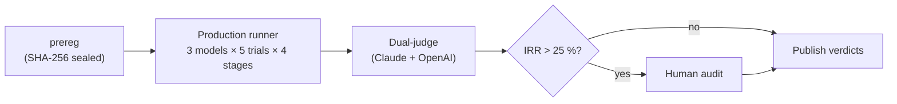

# PhysLit

> **A pre-registered, audit-resolved diagnostic for physics literacy in large language models.**
> PhysLit asks whether a frontier LLM can reason *inside* an unfamiliar physics framework — not whether it can solve textbook problems. Outputs are binary cognitive judgments, not leaderboard scores.

PhysLit is a research artifact, not a product. Every design decision optimizes for **methodological auditability**: pre-registered predictions, SHA-256-sealed inputs, fresh API session per stage, dual-LLM judging with an IRR gate, and a human-audit pathway for disagreement.

---

## v0.1 result (2026-05-11)

Two predictions, locked at SHA-256 `769818275e6a256...0c7df425` (tag [`prereg-v0.1-locked`](https://github.com/dongzhang84/physlit/releases/tag/prereg-v0.1-locked)) **before any production trial**, evaluated on Aristotelian Mechanics across Claude Opus 4.7, GPT-5.5, and Gemini 3.1 Pro at N=5 trials each:

- **P1 — Induction failure under training-data conflict: CONFIRMED.** 2 of 3 models (Claude, Gemini) introduce banned modern-physics concepts (`dense`, `forceful`, `surface-supported`, …) in ≥ 3/5 trials of Stage 1, despite an explicit ban in the prompt.
- **P3 — Meta-cognitive miscalibration: CONFIRMED.** 10 trials contain at least one Stage-1-3 failure; in **7 of those 10 (70 %)** the model fails to identify its own failure during Stage 4 self-reflection — well above the pre-registered 30 % threshold.

A third finding emerged from the methodology itself:

- **Cross-vendor LLM-judge inter-rater reliability = 36.67 %.** Two independent judges (Claude + OpenAI) disagreed on more than a third of all PASS/FAIL classifications, triggering the prereg-mandated human audit. No single-judge LLM benchmark would have been reliable on this material.

**Scope**: 1 framework × 3 models × N=5 × 4 stages = 60 production API calls + 120 judge calls = **180 calls, ≈ $14 USD total.**

| Where to look | What's in it |
| --- | --- |
| [`analysis/v0_1_report.md`](./analysis/v0_1_report.md) | English narrative report — motivation, design, results, next steps |
| [`analysis/v0_1_findings.md`](./analysis/v0_1_findings.md) | Auto-generated pre- and post-audit numerics + pipeline diagram |
| [`analysis/v0_1_audit_human_review.md`](./analysis/v0_1_audit_human_review.md) | All 22 human-audit verdicts on DISAGREE cases |
| [`results/<model-id>/`](./results/) | Verbatim trial JSONs + judge verdicts for every API call |

---

## 02_fmv result (2026-05-18)

PhysLit's second framework experiment: the **F=mv World**, a counterfactual world where a body's pace is set by the push acting on it at that moment (force ∝ velocity, not acceleration). Four predictions locked at tag [`prereg-02_fmv-locked`](https://github.com/dongzhang84/physlit/releases/tag/prereg-02_fmv-locked) **before any production trial**, evaluated across the same three models at N=5:

- **P1 — Induction failure: REFUTED.** Only 4 of 15 Stage 1 trials failed — all four Gemini. Claude and GPT induced the F=mv rules cleanly, without sliding back to F=ma. Frontier models did *not* fail to reason inside this counterfactual world — the opposite of v0.1.
- **P2 — Meta-cognitive miscalibration: CONFIRMED.** 4 of 6 failure-containing trials over-claim in Stage 4 self-reflection (66.7 %).
- **P3 — Mechanical criteria reduce judge disagreement: PARTIALLY CONFIRMED.** Dual-judge IRR 26.67 % — down from v0.1's 36.67 %, but not below the 25 % bar.
- **P4 — Stage 3 quantitative leak: REFUTED.** 0 of 45 quantitative predictions named the right direction with an F=ma ratio.

Two methodology findings:

- **A mechanically-specified criterion makes an LLM disagree-resolver reliable.** An LLM resolver run against the mechanical 02_fmv criteria agreed with the human audit on **12/12 content cases (100 %)** — versus 29.4 % in v0.2 on v0.1's interpretation-laden criteria.
- **Judge reliability does not transfer across frameworks.** The OpenAI judge was the more reliable of the two on v0.1 Aristotelian; on F=mv it agreed with the human audit on 3/14 disagreement cases, the Claude judge on 11/14 — same prompts, same models.

**Scope**: content axis only (the N9-N12 structural axis is out of scope by explicit prereg decision). 60 production + 120 judge + 12 resolver calls ≈ **$17.3 USD**.

| Where to look | What's in it |
| --- | --- |
| [`analysis/02_fmv_report.md`](./analysis/02_fmv_report.md) | English narrative report — motivation, design, results |
| [`analysis/02_fmv_findings.md`](./analysis/02_fmv_findings.md) | Judging report + post-audit numerics |
| [`analysis/02_fmv_audit_human_review.md`](./analysis/02_fmv_audit_human_review.md) | Human verdicts on all 14 disagreement cases |
| [`results/<model-id>/02_fmv/`](./results/) | Verbatim trial JSONs (+ `.md` companions) + judge verdicts |

---

## 02_fmv.1 result (2026-05-18)

The **structural axis** (necessary conditions N9-N12: parsimony, independence, traceability, hierarchy) applied to the 60 frozen `02_fmv` trials — an additive re-analysis layer, no new tested-model trials. Two predictions locked at tag [`prereg-02_fmv.1-locked`](https://github.com/dongzhang84/physlit/releases/tag/prereg-02_fmv.1-locked) before judging:

- **P1 — Mechanical (Stage-1-only) criteria lower the structural IRR: REFUTED.** The structural-axis dual-judge IRR is 46.67 % — *above* v0.2 Aristotelian's 40 %, not below. The v0.2 Stage 1+2 double-count was a real defect, but it was not the dominant cause of structural disagreement: the 7 splits were N10/N11/N12 judgment calls, not counting artifacts.
- **P2 — The structural axis catches a content-missed failure: CONFIRMED.** 8 of the 9 trials that passed all three content stages fail the structural axis. Only 1 of 15 trials survives as composite PASS.

Two methodology findings:

- **Judge reliability reverses completely between axes.** On the content axis the Claude judge agreed with the human audit 86 % and the OpenAI judge 21 %; on the structural axis the order flips — Claude 14 %, OpenAI 86 %. Same models, same trials, only the task changed. Judge reliability is task-dependent, not model-dependent.
- **Content and structural quality are anti-correlated.** GPT passed all 5 content axes but failed all 5 structural; Gemini failed all 5 content but passed 3 of 5 structural. The two axes measure genuinely different competences.

**Scope**: structural axis over the frozen `02_fmv` trials. 30 structural-judge + 7 resolver calls ≈ **$4.0 USD**.

| Where to look | What's in it |
| --- | --- |
| [`analysis/02_fmv_1_report.md`](./analysis/02_fmv_1_report.md) | English narrative report — design, results |
| [`analysis/02_fmv_1_findings.md`](./analysis/02_fmv_1_findings.md) | Judging report + post-audit numerics |
| [`analysis/02_fmv_1_structural_audit_human_review.md`](./analysis/02_fmv_1_structural_audit_human_review.md) | Human verdicts on all 7 structural disagreement cases |
| [`results/<model-id>/02_fmv/structural/`](./results/) | Verbatim structural-judge verdicts |

---

## Why this exists

Existing LLM physics benchmarks count correct answers and report a percentage. Two structural flaws follow:

1. The percentage cannot distinguish *"understands physics"* from *"has seen similar problems during training."*
2. The percentage carries no information about cognitive boundaries — *90 % vs 91 %* tells you nothing about what the model can and cannot do.

PhysLit asks a different question: **can the model do the cognitive work that constitutes physical reasoning** — induction, formulation, prediction — inside a framework whose conclusions don't match its training prior? Aristotelian Mechanics is the cleanest test case: historically real, internally consistent, present in training data primarily as a *position the training data argues against*. A model that has "learned Aristotle" is precisely a model that has learned to dismiss this framework; the test is whether it can suspend that dismissal long enough to reason inside the framework on its own terms.

Full motivation and design rationale: [`docs/product-spec.md`](./docs/product-spec.md) ([中文](./docs/product-spec.zh.md)).

---

## How it works



Four design rules, all enforced in code:

1. **Pre-registration is irreversible.** Predictions live in `predictions/v0_1_prereg.md`, SHA-256-sealed and git-tag-locked. A pre-commit hook (`scripts/verify_prereg_integrity.py`) and a matching CI check fail any silent edit. New predictions require a new tag.
2. **Fresh API session per stage.** Stages 1, 2, 3, 4 each create a new client and a new session UUID. No context reuse, no multi-turn — the model only sees its own prior outputs replayed as text.
3. **Open data verbatim.** Every prompt sent + every response received is committed under `prompts/` and `results/`. Selective publishing is forbidden — failed trials are committed as failure records.
4. **Dual-judge IRR + human-audit gate.** Stage-1-3 PASS/FAIL judgments run through two independent LLM judges; disagreement > 25 % on any stage triggers a human audit before results can be published.

Full architectural rules: [`CLAUDE.md`](./CLAUDE.md).

---

## Reproduce v0.1

Every verdict in the v0.1 report is reproducible from the locked tag.

```bash
git clone https://github.com/dongzhang84/physlit
cd physlit
git checkout prereg-v0.1-locked
uv sync

# .env.local
ANTHROPIC_API_KEY=...
OPENAI_API_KEY=...
GEMINI_API_KEY=...

uv run python scripts/run_v0_1.py        # ≈ $5.76, 60 production API calls, ~30 min
uv run python scripts/judge_v0_1.py      # ≈ $8.23, 120 judge API calls
uv run python scripts/apply_audit.py     # 0 cost — replays the 22 committed audit verdicts
```

`analysis/v0_1_findings.md` will now contain both pre-audit and post-audit blocks. The 22 audit verdicts are committed both as prose ([`analysis/v0_1_audit_human_review.md`](./analysis/v0_1_audit_human_review.md)) and as an embedded dict in `scripts/apply_audit.py`; no human re-audit is required to reproduce the published verdicts. Tested-model output is non-deterministic across vendors, so your trial responses will not be byte-identical to ours — but the verdict pattern is robust per prereg.

---

## Repo layout

```
physlit/
├── predictions/v0_1_prereg.md            pre-reg, SHA-256 sealed, tag-locked
├── frameworks/01_aristotelian/           12 observations, criteria, prediction scenarios
├── prompts/                              all stage + judge prompts, frozen at lock
├── results/<model-id>/01_aristotelian/   60 trial JSONs + 120 judge verdicts, verbatim
├── analysis/                             findings, audit, narrative report
├── scripts/                              run / judge / audit / verify
├── src/physlit/                          runners, schema, judges (Python, mypy strict)
├── docs/product-spec.md                  methodology, design rules, predictions
├── docs/implementation-guide.md          phase-by-phase build plan
├── CLAUDE.md                             architectural rules (load-bearing)
├── CHANGELOG.md                          phase-by-phase release notes
├── LICENSE                               MIT — code
└── LICENSE-DATA                          CC BY 4.0 — frameworks, predictions, prompts, results, analysis
```

---

## Local development

```bash
uv sync                              # install deps + dev tools
uv run pre-commit install            # one-time: hook ruff + prereg-integrity + spec validators
```

Local gates (must all pass before commit):

```bash
uv run ruff format --check .
uv run ruff check .
uv run mypy
uv run pytest
uv run python scripts/verify_prereg_integrity.py    # confirms prereg SHA-256 unchanged
```

CI never runs real API calls — only mocks in `tests/test_runners_with_mock.py`. Costly runs (`run_v0_1.py`, `judge_v0_1.py`) are gated by a confirmation prompt when the estimated spend exceeds $5.

---

## Status & roadmap

| Round | Scope | Status |
| --- | --- | --- |
| **v0.1** | Aristotelian Mechanics, content axis × 3 models × N=5 | ✅ Done — 2026-05-11 |
| **v0.2** | Structural axis (N9-N12) + LLM disagree-resolvers, additive re-analysis of v0.1 | ✅ Done — 2026-05-13 |
| **02_fmv** | F=mv counterfactual world, content axis × 3 models × N=5 | ✅ Done — 2026-05-18 |
| **02_fmv.1** | Structural axis (N9-N12) on the F=mv trials, additive re-analysis | ✅ Done — 2026-05-18 |
| next | Further frameworks judged under a common mechanical-criteria standard; per-axis judge validation | Planned |

Pre-registration is framework-scoped from 02_fmv onward (tag `prereg-<id>-locked`). The original v1.0 ambition of 15 frameworks has been retired in favor of methodology-first iteration.

---

## Contributing

PhysLit welcomes:

- **Reproduction reports** — run `scripts/run_v0_1.py` + `judge_v0_1.py` + `apply_audit.py` yourself and open an issue if your verdict pattern diverges from ours.
- **Methodology critique** as GitHub issues — especially around the IRR threshold (25 %) and the audit pathway.
- **Framework proposals** for v0.2 — open an issue describing the framework, its Category (A: historical / B: counterfactual self-consistent / C: arbitrary rules), and a draft observation set. Authoring tier and minimum content checklist live in [`docs/implementation-guide.md`](./docs/implementation-guide.md).
- **Code PRs** must pass `ruff check`, `mypy --strict`, `pytest`, and the prereg integrity hook.

PhysLit does **not** accept:

- Changes to the locked prereg or any frozen artifact under the `prereg-v0.1-locked` tag.
- Pull requests that compromise the four design rules (multi-turn shortcuts, judge-pruning to lower IRR, selective result publishing, alias-pinned model IDs).

---

## License

- **Code** (`src/`, `tests/`, `scripts/`, configs) — [MIT](./LICENSE)
- **Data** (`frameworks/`, `predictions/`, `prompts/`, `results/`, `analysis/`) — [CC BY 4.0](./LICENSE-DATA)

The split is deliberate: re-use the code freely without attribution friction; re-use the data with attribution so the prereg trail stays traceable.

---

## Citation

If you use PhysLit in academic or evaluation work, please cite the locked prereg tag:

```bibtex
@misc{physlit_v0_1_2026,
  author       = {Zhang, Dong},
  title        = {{PhysLit v0.1}: A Pre-Registered Diagnostic of LLM Physics Literacy on Aristotelian Mechanics},
  year         = {2026},
  howpublished = {\url{https://github.com/dongzhang84/physlit}},
  note         = {Pre-registration tag \texttt{prereg-v0.1-locked}, SHA-256 \texttt{769818275e6a25665116f13be2a4be440f00a8f49453fd8587239b410c7df425}}
}
```

## Upstream

PhysLit grew out of [`indie-product-playbook`](https://github.com/dongzhang84/indie-product-playbook). The original spec lives at `ideas/physlit.md` upstream.
