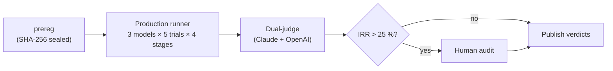

# PhysLit

> **A pre-registered, audit-resolved diagnostic for physics literacy in large language models.**
> PhysLit asks whether a frontier LLM can reason *inside* an unfamiliar physics framework — not whether it can solve textbook problems. Outputs are binary cognitive judgments, not leaderboard scores.

PhysLit is a research artifact, not a product. Every design decision optimizes for **methodological auditability**: pre-registered predictions, SHA-256-sealed inputs, fresh API session per stage, dual-LLM judging with an IRR gate, and a human-audit pathway for disagreement.

---

## Results across three frameworks

Three frameworks tested at temperature 0 across Claude Opus 4.7, GPT-5.5, and Gemini 3.1 Pro, N=5 trials each. **Composite content PASS** is the strongest cell — a trial earns one only if Stage 1 induction, Stage 2 formulation, and every Stage 3 quantitative scenario all PASS.

| Framework | Category | Difficulty | Composite PASS | Sub-rounds |
|---|---|---|---|---|
| **F=mv** | Counterfactual world | Easy | 9/15 | `02_fmv` · `02_fmv.1` · `02_fmv.2` |
| **Aristotelian** | Historical framework | Medium | 5/15 | `v0.1` · `v0.2` · `v0.2.1` · `v0.3` |
| **Decay World** | Counterfactual world | Hard | 0/15 | `03_decay` |

A separate behavioural regularity holds across all three: among failure-containing trials, the model **over-claims correctness in Stage 4** 65-70 % of the time. v0.1 70 %, 02_fmv 66.7 %, 03_decay 67 %. Stage 4 self-assessment is approximately framework-independent in this paradigm — frontier models do not get better at identifying their own slips as the framework gets harder.

Two methodology findings transfer across rounds:

- **Dual-judge inter-rater reliability is necessary, not optional.** Stage 1-3 IRR was 36.67 %, 26.67 %, and 40.00 % across the three frameworks; each triggered the prereg-mandated human audit. The "more reliable" judge changed across frameworks — OpenAI on v0.1, Claude on `02_fmv` and `03_decay`. Selective use of either judge alone would have produced systematically wrong content verdicts on at least one round.
- **An LLM disagree-resolver is reliable when criteria are mechanical.** Agent 2 (per-scenario resolver on the Decay World) agreed with the human audit on 31/32 = 97 %. Agent 1 on content reached 82-100 % when the criteria were specified mechanically (`02_fmv`, `03_decay`), and 29.4 % when they required interpretation (v0.2 on the v0.1 criteria).

---

## Easy — F=mv World (`02_fmv` / `02_fmv.1` / `02_fmv.2`)

A Tier-1 counterfactual world in which a body's pace tracks the present push (force ∝ velocity, not acceleration). The framework conflicts with F=ma numerically: a steadily pushed body moves at a steady pace, a released body stops at once, all bodies fall at one unchanging pace.

- **`02_fmv`** (2026-05-18, [report](./analysis/fmv/02_fmv_report.md)): the headline run. **P1 REFUTED** — Claude and GPT both induced the F=mv rules cleanly in every trial; only Gemini slid back. Composite content **9/15**. The result reverses v0.1's "induction fails" finding; frontier models *can* reason inside a counterfactual world when the rule is single-domain.
- **`02_fmv.1`** (2026-05-18, [report](./analysis/fmv/02_fmv_1_report.md)): a structural-axis re-analysis of the same trials (parsimony, independence, traceability, hierarchy). Content and structural quality are anti-correlated across vendors — Claude content-strong but structurally weak, GPT the reverse.
- **`02_fmv.2`** (2026-05-20, [report](./analysis/fmv/02_fmv_2_report.md)): a single-variable axiomatisation control. Adding one paragraph to the Stage 1 prompt asking for the smallest rule set with explicit cross-references **doubled the structural pass rate** (5/15 → 11/15) without lowering content. Composite jumped 1/15 → 6/15.

---

## Medium — Aristotelian Mechanics (`v0.1` / `v0.2` / `v0.2.1` / `v0.3`)

A historical framework: real, internally coherent, present in training data primarily as a position to be argued against. Tests whether a model can suspend "I know this is wrong" long enough to reason inside the framework on its own terms.

- **`v0.1`** (2026-05-11, [report](./analysis/aristotelian/v0_1_report.md)): the project's first headline. **P1 (induction failure under training-data conflict) CONFIRMED** — 2 of 3 models introduce banned modern-physics concepts despite an explicit ban. **P3 (meta-cognitive miscalibration) CONFIRMED** at 70 %. Composite content **5/15**.
- **`v0.2` / `v0.2.1`** (2026-05-13, [findings](./analysis/aristotelian/v0_2_findings.md)): structural axis (N9–N12) layered onto the frozen v0.1 dataset. Structural axis adds failure detection (composite drops to 2/15); an LLM disagree-resolver on v0.1's interpretation-laden criteria reproduces the human audit only 29.4 % of the time — the finding that motivated the mechanical-criteria rewrite from `02_fmv` onward.
- **`v0.3`** (2026-05-20, [report](./analysis/aristotelian/v0_3_report.md)): cross-framework replication of `02_fmv.2`. The same one-paragraph axiomatisation cue, byte-identical to the F=mv version, lifts Aristotelian structural pass rate **8/15 → 15/15** (saturated). The cross-framework replication holds: same intervention, same direction, same magnitude on two different frameworks.

---

## Hard — Decay World (`03_decay`)

A Tier-1 counterfactual world in which every isolated system's directly measured state (oscillation amplitude, absolute temperature, rotation rate, orbital radius) shrinks at a fixed fractional rate per second (≈ 0.99/s), universally across mechanical, thermal, rotational, and orbital domains, **with no underlying "energy" substrate** and **every standard dissipative mechanism (friction, drag, damping, viscosity, radiative loss) explicitly closed off**. Designed to push back against the "frontier models can do counterfactuals" reading of `02_fmv` by changing three load-bearing properties at once: rule binds to the measured quantity (no hidden substrate), rule is universal across domains, dissipative mechanisms are closed off in the observations themselves.

- **`03_decay`** (2026-05-28, [report](./analysis/decay/03_decay_report.md)): **all four prereg predictions CONFIRMED.**
  - **P1**: composite content PASS **0/15**. Every model, every vendor, every trial fails. The lowest of the three frameworks.
  - **P2**: hidden-substrate framing is the only §5 disqualifying pattern that fires. Models import standard orbital mechanics and derive radius from sideways speed, treating speed as the underlying decaying thing — the design trap.
  - **P3**: 37 decay-correct / **23 ratio-leaked** / **0 direction-wrong**. Every model knows *something* decays; no model gets the right ratio. Direction-wrong bucket is empty.
  - **P4**: over-claim rate **67 %**, identical band to the two prior frameworks (70 %, 66.7 %).
- A methodology finding overshadows the prereg verdicts: the OpenAI judge fabricated or misclassified §3 banned-token citations in **16 of 18 Part A FAIL clauses** — a stress test the Decay World's long-ban-list-plus-topic-overlap design happens to trigger. The third consecutive round in which the relatively reliable judge changes; PhysLit's dual-judge + audit safeguard is load-bearing.

---

## Why this exists

Existing LLM physics benchmarks count correct answers and report a percentage. Two structural flaws follow:

1. The percentage cannot distinguish *"understands physics"* from *"has seen similar problems during training."*
2. The percentage carries no information about cognitive boundaries — *90 % vs 91 %* tells you nothing about what the model can and cannot do.

PhysLit asks a different question: **can the model do the cognitive work that constitutes physical reasoning** — induction, formulation, prediction — inside a framework whose conclusions don't match its training prior? Three frameworks across a deliberate difficulty gradient stress-test this:

- **Aristotelian Mechanics** is the cleanest *historical* test case: real, internally consistent, present in training data primarily as a position to be argued against.
- **F=mv** is the cleanest *single-equation counterfactual*: no literature, no historical referent, force ∝ velocity throughout.
- **Decay World** is a *cross-domain counterfactual*: rules bind to the directly measured quantity (no hidden substrate), apply uniformly across mechanics / thermal / rotation / orbital, and every standard dissipative mechanism is explicitly closed off.

A model that "knows physics" should fail differently in each, in predictable ways. PhysLit pre-registers those predictions and audits the verdicts.

Full motivation and design rationale: [`docs/product-spec.md`](./docs/product-spec.md) ([中文](./docs/product-spec.zh.md)).

---

## How it works



Four design rules, all enforced in code:

1. **Pre-registration is irreversible.** Predictions live in `predictions/v0_1_prereg.md`, SHA-256-sealed and git-tag-locked. A pre-commit hook (`scripts/verify_prereg_integrity.py`) and a matching CI check fail any silent edit. New predictions require a new tag.
2. **Fresh API session per stage.** Stages 1, 2, 3, 4 each create a new client and a new session UUID. No context reuse, no multi-turn — the model only sees its own prior outputs replayed as text.
3. **Open data verbatim.** Every prompt sent + every response received is committed under `prompts/` and `results/`. Selective publishing is forbidden — failed trials are committed as failure records.
4. **Dual-judge IRR + human-audit gate.** Stage-1-3 PASS/FAIL judgments run through two independent LLM judges; disagreement > 25 % on any stage triggers a human audit before results can be published.

Full architectural rules: [`CLAUDE.md`](./CLAUDE.md).

---

## Reproducing the experiments

Every verdict in every round is reproducible from its locked prereg tag. Each round has the same three-script shape: run → judge → apply.

```bash
git clone https://github.com/dongzhang84/physlit
cd physlit
uv sync

# .env.local
ANTHROPIC_API_KEY=...
OPENAI_API_KEY=...
GEMINI_API_KEY=...
```

Then check out the round you want to reproduce and run its scripts:

```bash
# v0.1 (Aristotelian, content axis) — prereg-v0.1-locked
git checkout prereg-v0.1-locked
uv run python scripts/run_v0_1.py        # 60 production calls
uv run python scripts/judge_v0_1.py      # 120 judge calls
uv run python scripts/apply_audit.py     # 0 cost — replays the 22 committed audit verdicts

# 02_fmv (F=mv, content axis) — prereg-02_fmv-locked
git checkout prereg-02_fmv-locked
uv run python scripts/run_02_fmv.py
uv run python scripts/judge_02_fmv.py
uv run python scripts/apply_02_fmv_audit.py

# 03_decay (Decay World, content + scenario + meta) — prereg-03_decay-locked
git checkout prereg-03_decay-locked
uv run python scripts/run_03_decay.py
uv run python scripts/judge_03_decay.py
uv run python scripts/apply_03_decay.py
```

The corresponding `analysis/<framework>/<round>_findings.md` will contain both pre-audit and post-audit blocks. All human-audit verdicts are committed both as prose (`analysis/<framework>/<round>_audit_human_review.md`) and as embedded dicts in the apply scripts; no human re-audit is required to reproduce the published verdicts. Tested-model output is non-deterministic across vendors, so trial responses will not be byte-identical to ours — but verdict patterns are robust per prereg.

Per-round costs (production + judge, ≈): v0.1 $14 · 02_fmv $17 · 02_fmv.2 $5 · v0.3 $7 · 03_decay $25.

---

## Repo layout

```
physlit/
├── predictions/<round>_prereg.md         pre-regs, SHA-256 sealed, tag-locked (one per round)
├── frameworks/01_aristotelian/           Aristotelian framework: observations, criteria, scenarios
├── frameworks/02_fmv/                    F=mv framework
├── frameworks/03_decay/                  Decay World framework
├── prompts/                              global Stage 1-4 prompts (framework-specific prompts live under frameworks/<id>/prompts/)
├── results/<model-id>/<framework-id>/    trial JSONs + judge verdicts, verbatim
├── analysis/aristotelian/                v0.1, v0.2, v0.3 findings/reports/audit records
├── analysis/fmv/                         02_fmv, 02_fmv.1, 02_fmv.2 findings/reports/audit records
├── analysis/decay/                       03_decay findings/reports/audit records
├── scripts/                              run / judge / apply / verify (one set per round)
├── src/physlit/                          runners, schema, judges (Python, mypy strict)
├── docs/product-spec.md                  methodology, design rules, predictions
├── docs/implementation-guide.md          phase-by-phase build plan
├── CLAUDE.md                             architectural rules (load-bearing)
├── CHANGELOG.md                          per-round release notes + cross-framework summary
├── LICENSE                               MIT — code
└── LICENSE-DATA                          CC BY 4.0 — frameworks, predictions, prompts, results, analysis
```

---

## Local development

```bash
uv sync                              # install deps + dev tools
uv run pre-commit install            # one-time: hook ruff + prereg-integrity + spec validators
```

Local gates (must all pass before commit):

```bash
uv run ruff format --check .
uv run ruff check .
uv run mypy
uv run pytest
uv run python scripts/verify_prereg_integrity.py    # confirms prereg SHA-256 unchanged
```

CI never runs real API calls — only mocks in `tests/test_runners_with_mock.py`. Costly runs (`run_v0_1.py`, `judge_v0_1.py`) are gated by a confirmation prompt when the estimated spend exceeds $5.

---

## Status & roadmap

| Round | Scope | Status |
| --- | --- | --- |
| **v0.1** | Aristotelian Mechanics, content axis × 3 models × N=5 | ✅ Done — 2026-05-11 |
| **v0.2** | Structural axis (N9-N12) + LLM disagree-resolvers, additive re-analysis of v0.1 | ✅ Done — 2026-05-13 |
| **02_fmv** | F=mv counterfactual world, content axis × 3 models × N=5 | ✅ Done — 2026-05-18 |
| **02_fmv.1** | Structural axis (N9-N12) on the F=mv trials, additive re-analysis | ✅ Done — 2026-05-18 |
| **02_fmv.2** | Axiomatisation control: single-variable Stage 1 prompt change vs `02_fmv` | ✅ Done — 2026-05-20 |
| **v0.3** | Cross-framework replication of `02_fmv.2`'s axiomatisation control on Aristotelian | ✅ Done — 2026-05-20 |
| **03_decay** | Decay World, content + per-scenario + meta axes × 3 models × N=5 | ✅ Done — 2026-05-28 |
| next | Paper writeup (three frameworks, methodology stress findings). Further frameworks deferred pending writeup outcome. | Planned |

Pre-registration is framework-scoped from `02_fmv` onward (tag `prereg-<id>-locked`). The original v1.0 ambition of 15 frameworks has been retired in favor of methodology-first iteration.

---

## Contributing

PhysLit welcomes:

- **Reproduction reports** — pick a round, check out its `prereg-<id>-locked` tag, run its `run_*.py` + `judge_*.py` + `apply_*.py`, and open an issue if your verdict pattern diverges from ours.
- **Methodology critique** as GitHub issues — especially around the IRR threshold (25 %) and the audit pathway.
- **Framework proposals** — open an issue describing the framework, its Category (A: historical / B: counterfactual self-consistent / C: arbitrary rules), and a draft observation set. Authoring tier and minimum content checklist live in [`docs/implementation-guide.md`](./docs/implementation-guide.md).
- **Code PRs** must pass `ruff check`, `mypy --strict`, `pytest`, and the prereg integrity hook.

PhysLit does **not** accept:

- Changes to any locked prereg or its frozen artifacts (any tag matching `prereg-*-locked`).
- Pull requests that compromise the four design rules (multi-turn shortcuts, judge-pruning to lower IRR, selective result publishing, alias-pinned model IDs).

---

## License

- **Code** (`src/`, `tests/`, `scripts/`, configs) — [MIT](./LICENSE)
- **Data** (`frameworks/`, `predictions/`, `prompts/`, `results/`, `analysis/`) — [CC BY 4.0](./LICENSE-DATA)

The split is deliberate: re-use the code freely without attribution friction; re-use the data with attribution so the prereg trail stays traceable.

---

## Citation

If you use PhysLit in academic or evaluation work, please cite the locked prereg tag for the specific round(s) you reference:

```bibtex
@misc{physlit_v0_1_2026,
  author       = {Zhang, Dong},
  title        = {{PhysLit v0.1}: A Pre-Registered Diagnostic of LLM Physics Literacy on Aristotelian Mechanics},
  year         = {2026},
  howpublished = {\url{https://github.com/dongzhang84/physlit}},
  note         = {Pre-registration tag \texttt{prereg-v0.1-locked}, SHA-256 \texttt{769818275e6a25665116f13be2a4be440f00a8f49453fd8587239b410c7df425}}
}

@misc{physlit_02_fmv_2026,
  author       = {Zhang, Dong},
  title        = {{PhysLit 02\_fmv}: A Pre-Registered Diagnostic of LLM Physics Literacy on the F=mv Counterfactual World},
  year         = {2026},
  howpublished = {\url{https://github.com/dongzhang84/physlit}},
  note         = {Pre-registration tag \texttt{prereg-02\_fmv-locked}}
}

@misc{physlit_03_decay_2026,
  author       = {Zhang, Dong},
  title        = {{PhysLit 03\_decay}: A Pre-Registered Diagnostic of LLM Physics Literacy on the Decay World},
  year         = {2026},
  howpublished = {\url{https://github.com/dongzhang84/physlit}},
  note         = {Pre-registration tag \texttt{prereg-03\_decay-locked}}
}
```

## Upstream

PhysLit grew out of [`indie-product-playbook`](https://github.com/dongzhang84/indie-product-playbook). The original spec lives at `ideas/physlit.md` upstream.
