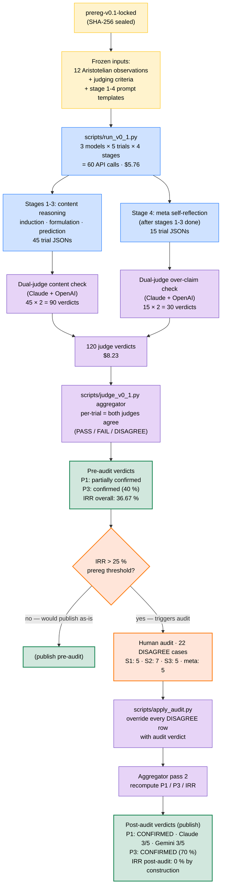

# PhysLit v0.1 — Findings

This file accumulates v0.1 evaluation findings, including
R1(b) Gemini post-trial-set re-ping disclosures.

## Pipeline overview

The v0.1 evaluation flow from prereg lock to publish-ready findings.
Stages 1-3 (induction / formulation / prediction) are content reasoning;
Stage 4 (meta self-reflection) is judged under different criteria
(over-claim). The IRR gate is the prereg-mandated point at which
dual-judge disagreement triggers the human-audit pathway; this v0.1
run exceeded the 25 % threshold and therefore went through audit.

**Reading guide:**

- **Yellow** = frozen prereg envelope (pinned by `prereg-v0.1-locked` tag; SHA-256 protected)
- **Blue** = production runner (tested-model API calls)
- **Purple** = dual judging and aggregation
- **Orange** = IRR gate + human audit (the prereg-mandated tie-breaker)
- **Green** = publication-ready verdicts

**Total API calls:** 60 production + 120 judging = **180 calls**, $13.99 USD.

---

## R1(b) post-trial-set re-ping (Gemini)

- Trial-set output root: `/Users/dong/Projects/physlit/results/_calibration/20260509T172235Z`
- Re-ping timestamp (UTC): `2026-05-09T17:27:05Z`
- Lock-time identifier:    `gemini-3.1-pro-preview`
- Post-run identifier:     `gemini-3.1-pro-preview`
- Identity-field drift:    **no**

## R1(b) post-trial-set re-ping (Gemini)

- Trial-set output root: `/Users/dong/Projects/physlit/results/_calibration/20260509T173127Z/gemini-3.1-pro-preview`
- Re-ping timestamp (UTC): `2026-05-09T17:41:36Z`
- Lock-time identifier:    `gemini-3.1-pro-preview`
- Post-run identifier:     `gemini-3.1-pro-preview`
- Identity-field drift:    **no**

## R1(b) post-trial-set re-ping (Gemini)

- Trial-set output root: `/Users/dong/Projects/physlit/results/gemini-3.1-pro-preview`
- Re-ping timestamp (UTC): `2026-05-09T18:39:08Z`
- Lock-time identifier:    `gemini-3.1-pro-preview`
- Post-run identifier:     `gemini-3.1-pro-preview`
- Identity-field drift:    **no**

## v0.1 final report
- Generated: `2026-05-09T18:49:09Z`
- Models: claude-opus-4-7, gpt-5.5-2026-04-23, gemini-3.1-pro-preview
- N trials per model: 5
- Judge cost (estimated): $8.2274

### IRR (judge disagreement rate)
- Stage 1: 5/15 = 33.33%
- Stage 2: 7/15 = 46.67%
- Stage 3: 5/15 = 33.33%
- Meta:    5/15 = 33.33%
- Overall: 36.67%

### P1 — Induction failure under training-data conflict
**Verdict: PARTIALLY CONFIRMED**

Per-model both-judge-FAIL counts on Stage 1: {'claude-opus-4-7': 1, 'gemini-3.1-pro-preview': 2}. Per-model both-judge-PASS counts: {'claude-opus-4-7': 2, 'gpt-5.5-2026-04-23': 3, 'gemini-3.1-pro-preview': 2}. Per-model judge-DISAGREE counts: {'claude-opus-4-7': 2, 'gpt-5.5-2026-04-23': 2, 'gemini-3.1-pro-preview': 1}.

### P3 — Meta-cognitive miscalibration
**Verdict: CONFIRMED**

Failure-containing trials: 5. Over-claim trials (both judges agree 'yes'): 2. Rate: 40.00%.

### Per-trial classification matrix

| Model | Trial | S1 | S2 | S3 | Over-claim | Any failure |
|---|---|---|---|---|---|---|
| `claude-opus-4-7` | 0 | PASS | FAIL | PASS | no | yes |
| `claude-opus-4-7` | 1 | PASS | PASS | PASS | vacuous | no |
| `claude-opus-4-7` | 2 | DISAGREE | DISAGREE | PASS | yes | no |
| `claude-opus-4-7` | 3 | DISAGREE | DISAGREE | DISAGREE | DISAGREE | no |
| `claude-opus-4-7` | 4 | FAIL | DISAGREE | PASS | DISAGREE | yes |
| `gpt-5.5-2026-04-23` | 0 | PASS | PASS | PASS | vacuous | no |
| `gpt-5.5-2026-04-23` | 1 | DISAGREE | PASS | DISAGREE | DISAGREE | no |
| `gpt-5.5-2026-04-23` | 2 | PASS | PASS | DISAGREE | no | no |
| `gpt-5.5-2026-04-23` | 3 | DISAGREE | DISAGREE | DISAGREE | DISAGREE | no |
| `gpt-5.5-2026-04-23` | 4 | PASS | PASS | PASS | vacuous | no |
| `gemini-3.1-pro-preview` | 0 | PASS | DISAGREE | PASS | DISAGREE | no |
| `gemini-3.1-pro-preview` | 1 | FAIL | FAIL | PASS | no | yes |
| `gemini-3.1-pro-preview` | 2 | PASS | PASS | PASS | vacuous | no |
| `gemini-3.1-pro-preview` | 3 | FAIL | DISAGREE | DISAGREE | yes | yes |
| `gemini-3.1-pro-preview` | 4 | DISAGREE | DISAGREE | FAIL | yes | yes |

## Post-audit findings
_Generated `2026-05-11T08:48:46Z` by `scripts/apply_audit.py` from the audit
verdicts in [`v0_1_audit_human_review.md`](./v0_1_audit_human_review.md).
The pre-audit findings block above is preserved as the original
dual-judge output; this block represents the prereg-mandated
human-audit resolution of the 22 DISAGREE rows. The locked
`predictions/v0_1_prereg.md` (and its SHA-256) is unchanged._
### IRR (judge disagreement rate)
**Pre-audit** (the rate that triggered the audit):
- Stage 1: 5/15 = 33.33%
- Stage 2: 7/15 = 46.67%
- Stage 3: 5/15 = 33.33%
- Meta:    5/15 = 33.33%
- Overall: 36.67%

Per the prereg, this overall rate exceeded the 25 % threshold; the audit was the prereg-mandated tie-breaker.

**Post-audit** (after applying the 22 audit verdicts):
- Stage 1: 0/15 = 0.00%
- Stage 2: 0/15 = 0.00%
- Stage 3: 0/15 = 0.00%
- Meta:    0/15 = 0.00%
- Overall: 0.00%

### P1 — Induction failure under training-data conflict
**Audit-resolved verdict: CONFIRMED**

- Per-model Stage 1 PASS counts: `{'claude-opus-4-7': 2, 'gpt-5.5-2026-04-23': 3, 'gemini-3.1-pro-preview': 2}`
- Per-model Stage 1 FAIL counts: `{'claude-opus-4-7': 3, 'gpt-5.5-2026-04-23': 2, 'gemini-3.1-pro-preview': 3}`
- Per-model residual-DISAGREE counts: `{}` (should be empty post-audit)

### P3 — Meta-cognitive miscalibration
**Audit-resolved verdict: CONFIRMED**

- Failure-containing trials (any Stage 1-3 audit-FAIL): 10
- Over-claim trials among them (audit-resolved 'yes'): 7
- Over-claim rate: 70.00%

### Per-trial classification matrix (audit-resolved)

| Model | Trial | S1 | S2 | S3 | Over-claim | Any failure |
|---|---|---|---|---|---|---|
| `claude-opus-4-7` | 0 | PASS | FAIL | PASS | no | yes |
| `claude-opus-4-7` | 1 | PASS | PASS | PASS | vacuous | no |
| `claude-opus-4-7` | 2 | FAIL | FAIL | PASS | yes | yes |
| `claude-opus-4-7` | 3 | FAIL | FAIL | FAIL | yes | yes |
| `claude-opus-4-7` | 4 | FAIL | FAIL | PASS | no | yes |
| `gpt-5.5-2026-04-23` | 0 | PASS | PASS | PASS | vacuous | no |
| `gpt-5.5-2026-04-23` | 1 | FAIL | PASS | PASS | yes | yes |
| `gpt-5.5-2026-04-23` | 2 | PASS | PASS | PASS | no | no |
| `gpt-5.5-2026-04-23` | 3 | FAIL | FAIL | FAIL | yes | yes |
| `gpt-5.5-2026-04-23` | 4 | PASS | PASS | PASS | vacuous | no |
| `gemini-3.1-pro-preview` | 0 | PASS | FAIL | PASS | yes | yes |
| `gemini-3.1-pro-preview` | 1 | FAIL | FAIL | PASS | no | yes |
| `gemini-3.1-pro-preview` | 2 | PASS | PASS | PASS | vacuous | no |
| `gemini-3.1-pro-preview` | 3 | FAIL | FAIL | PASS | yes | yes |
| `gemini-3.1-pro-preview` | 4 | FAIL | FAIL | FAIL | yes | yes |

_Resolved-from-DISAGREE rows are bolded in the audit file__(see [`v0_1_audit_human_review.md`](./v0_1_audit_human_review.md))__; this matrix presents the operational classifications used to__compute the P1 and P3 verdicts above._
