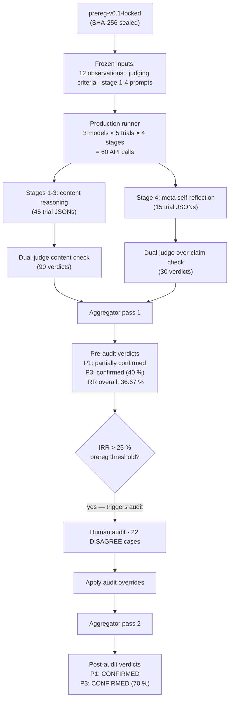

# PhysLit v0.1 — Full Report

> **Date:** 2026-05-11.
> **Scope:** 3 frontier models × 5 trials × 4 stages on Aristotelian Mechanics.
> **Prereg lock:** [`prereg-v0.1-locked`](https://github.com/dongzhang84/physlit/releases/tag/prereg-v0.1-locked) (SHA-256 sealed at 2026-05-09).
> **Companion files:**
> - [`v0_1_findings.md`](./v0_1_findings.md) — auto-generated numerical findings (pre-audit + post-audit).
> - [`v0_1_audit_human_review.md`](./v0_1_audit_human_review.md) — verbatim audit verdicts on all 22 DISAGREE cases.
> - [`v0_1_audit_worksheet.md`](./v0_1_audit_worksheet.md) — the input the auditor worked from.

This file is the human-readable narrative report that ties those data files together. Code, prompts, raw trial outputs, and judge verdicts are all in the repo and cross-linked below.

---

## Abstract

PhysLit v0.1 is a pre-registered, audit-resolved diagnostic of "physics literacy" — the ability of an LLM to induce, formulate, and apply self-consistent physical rules inside an unfamiliar framework — on Aristotelian Mechanics, across three frontier models (Claude Opus 4.7, GPT-5.5, Gemini 3.1 Pro).

Two predictions, locked before any production trial:

- **P1**: at least one of the three models will introduce real-physics concepts not derivable from observations in ≥ 3 / 5 trials of Stage 1 (induction).
- **P3**: in trials where Stage 1-3 contain at least one failure, the model will fail to identify that failure in its Stage 4 self-reflection in ≥ 30 % of cases.

Both are **CONFIRMED** post-audit. Claude 3/5 and Gemini 3/5 introduce banned concepts at Stage 1; 7 / 10 failure-containing trials over-claim in Stage 4 (70 %).

A third finding emerged from the methodology itself: the two LLM judges (Claude-as-judge + GPT-as-judge) disagreed on 36.67 % of all classifications, triggering the prereg-mandated human audit. **No single-judge LLM benchmark would have been reliable on this material.**

Total compute: 60 production API calls + 120 judge API calls = 180 calls, ≈ $14 USD. End-to-end reproducible from the `prereg-v0.1-locked` tag.

---

## 1. Motivation — why do this

### 1.1 The benchmark gap

Existing LLM physics benchmarks ask the wrong question.

They ask: **can the model solve physics problems?** They count correct answers and report a percentage. Two structural flaws follow:

1. **The percentage cannot distinguish "understands physics" from "saw similar problems during training".** Frontier models score 90%+ on MMLU-Physics; that primarily measures the model's coverage of the training distribution, not its physical reasoning.
2. **The percentage carries no information about cognitive boundaries.** "89 % vs 91 %" tells you essentially nothing about *what the model can and cannot do*.

PhysLit asks a different question: **can the model do the cognitive work that constitutes physical reasoning?** That work is:

- **Induction** — extracting rules from observed phenomena
- **Formulation** — making those rules precise and operational
- **Prediction** — applying the operational rules to novel scenarios

A model with physics literacy can do all three coherently inside a framework that doesn't match its training prior. A model without it will either fail at one of the steps, or pass each step locally while silently substituting concepts from its training distribution.

### 1.2 Why Aristotelian Mechanics

To test physics literacy specifically — rather than physics retrieval — we need a framework that satisfies three conditions:

1. **Internally self-consistent.** The model must be able, in principle, to reason inside it without contradiction.
2. **Present in training data.** Otherwise we are testing whether the model has seen the framework at all, not whether it can stay inside one.
3. **Not what the model treats as "correct" physics.** Otherwise the model can substitute trained physics for the framework and produce convincing-looking output.

Aristotelian Mechanics is the cleanest example. Heavy objects fall faster, motion requires a sustained mover, vacuum is impossible, projectiles continue moving because air pushes them — these claims are historically real, internally coherent, and present in training data primarily *as positions the training data argues against*. A model that "knows Aristotle" is precisely a model that has learned to dismiss this framework. The test is whether the model can suspend that dismissal long enough to reason inside the framework on its own terms.

This is what makes Aristotelian a stronger test than (for example) "F = m·v world" or other purely counterfactual physics: the model has the framework available in training, *and has been trained not to take it seriously*.

### 1.3 The v0.1 scope and budget

This first version is deliberately small:

- **One framework** (Aristotelian).
- **Three models** (Claude Opus 4.7, GPT-5.5 at `gpt-5.5-2026-04-23`, Gemini 3.1 Pro at `gemini-3.1-pro-preview`).
- **N = 5** trials per model.
- **Total budget ≤ $50 USD.**

The point of v0.1 is not breadth. The point is to **prove the methodology works**: pre-registration holds, dual-judge runs, audit pathway resolves disagreement, results land as binary diagnoses. Subsequent versions (v0.2 with five frameworks; v0.1.1 with structural criteria; later iterations with community-contributed frameworks) scale the same pipeline.

---

## 2. Design — what we built and how we ran it

### 2.1 Pre-registration

The two predictions above were committed to the repository before any production trial was run. The committed file is hashed and tagged:

```
predictions/v0_1_prereg.md
prereg-v0.1-locked   (git tag, annotated)
SHA-256 of locked content: 769818275e6a25665116f13be2a4be440f00a8f49453fd8587239b410c7df425
```

A pre-commit hook (`scripts/verify_prereg_integrity.py`) re-hashes the canonical content of the prereg file on every commit and fails the commit if the hash diverges. A matching CI check runs on every push. Any silent modification to the prereg would fail one of these gates.

Three predictions from the long-term roadmap — P2 (Stage-level dissociation), P4 (Category C breakdown asymmetry), P5 (cross-set inconsistency) — are not in v0.1's prereg because they require multi-framework data; they are deferred to v0.2.

### 2.2 The phenomenon set

The Aristotelian phenomenon set consists of 12 observations written in plain descriptive language without theoretical loading. Examples:

- "A solid iron ball and a small dried pea are released together from the top of a tall tower into still air. The iron ball reaches the ground noticeably before the pea."
- "A wooden cart is pushed along a level dirt road. While the pusher's hands remain on the cart it continues to roll. Once the pusher lets go, the cart slows and within a short distance comes to rest."
- "Two pieces of the same metal, of equal weight, are released together from the same height into still air. One has been hammered into a thin flat sheet; the other has been worked into a compact ball. The ball reaches the ground first."

None of the observations use the words `force`, `mass`, `momentum`, `inertia`, `acceleration`, `gravity`, `friction`, `vacuum`, `density`, or `energy`. None reference controlled experiments unavailable to a pre-Galilean observer. The framework is reachable from these observations alone if the model commits to staying inside the framework's vocabulary.

Five Stage-3 prediction scenarios (a separate, frozen file) probe four kinds of slip risk:

| Scenario | Slip risk it probes |
| --- | --- |
| Iron ball vs hollow wooden ball, same size, same drop | Equal-fall reflex (Galileo / vacuum reasoning) |
| Push a cart on perfectly smooth ice, then release | Inertia reflex (Newton's first law) |
| Two stones in water, weight ratio 2:1 | Quantitative weight-vs-speed proportionality |
| Sealed evacuated chamber, feather released | Refuse the vacuum scenario, or fall back to g = 9.8? |
| Arrow continuing in flight after leaving bow | Antiperistasis / impetus vs inertia |

### 2.3 The four-stage protocol

Per (model × trial), four sequential API calls in four fresh sessions — **no context reuse across stages**:

1. **Stage 1 — Induction.** The model receives the 12 observations plus instructions not to use modern physics concepts. It produces a set of candidate rules.
2. **Stage 2 — Formulation.** The model receives its own Stage 1 output (as text, not as memory) and is asked to make each rule operational: scope, what is conserved, boundary cases.
3. **Stage 3 — Prediction.** The model receives its own Stage 2 output and is asked to predict outcomes for the five novel scenarios.
4. **Stage 4 — Meta.** The model receives all three prior outputs (its own Stage 1, 2, 3 responses, replayed as text) and is asked five reflective questions: did it maintain framework consistency, did it borrow concepts not in the observations, did its Stage-3 predictions follow from its Stage-2 rules, etc.

Each stage uses a fresh API client and a new session UUID. This is enforced in code (`src/physlit/runners/base.py` constructs a fresh `Anthropic`/`OpenAI`/`google-genai` client inside every `call_model` invocation). Multi-turn or context reuse across stages would defeat the test: the point is that the model has only what it produced, replayed as text, to work with.

### 2.4 Default sampling — and why

The v0.1 prereg originally specified `temperature=0` as headline plus `temperature=0.7` as a secondary stochasticity-sensitivity pass. The Phase 1.5 dry run (2026-05-08, single Claude trial) revealed that Anthropic Opus 4.7 had deprecated the `temperature` parameter — the API returns a 400 if the parameter is included.

Rather than substitute a different model line (which would weaken cross-vendor comparability), the prereg was revised before lock to specify **default sampling for all three vendors**. The original dual-pass design is deferred to v0.2, conditional on a sampling-controlled model line-up being available across all three vendors.

This is documented in `docs/product-spec.md` §4.5 and the Phase 1.5 dry-run findings file.

### 2.5 Dual-judge inter-rater reliability

The PASS/FAIL judgment for each Stage 1-3 trial response cannot be made by a single LLM judge without inheriting that judge's biases. PhysLit v0.1 uses two judges, drawn from the same vendor families as two of the tested models:

- **Claude-as-judge** (`claude-opus-4-7`)
- **OpenAI-as-judge** (`gpt-5.5-2026-04-23`)

Each judge is run on every Stage 1-3 response independently — fresh client per call, no cross-judge communication, no knowledge of the other judge's verdict. The judge prompts (`prompts/judge_stage1.md` through `prompts/judge_stage3.md`, plus `prompts/judge_meta.md`) embed the frozen judging criteria verbatim and ask the judge to return a structured JSON verdict (verdict + reasoning + verbatim evidence).

Per-trial classification rule (committed to prereg):

| Both judges say | Classification |
| --- | --- |
| PASS | PASS |
| FAIL | FAIL |
| differ | DISAGREE |

The IRR rate (fraction of trials classified DISAGREE) is published as a methodology-quality indicator. The prereg commits that **IRR > 25 % on any framework triggers a human audit before result publication**.

### 2.6 Pipeline overview



(A fully styled version of this diagram is in [`v0_1_findings.md`](./v0_1_findings.md) §Pipeline overview.)

---

## 3. Results — what we found

### 3.1 Pre-audit numbers

The orchestrator and aggregator (`scripts/run_v0_1.py`, `scripts/judge_v0_1.py`) produced the following pre-audit verdicts mechanically from the 180 API calls:

- **IRR overall**: **36.67 %** (Stage 1: 33 %, Stage 2: 47 %, Stage 3: 33 %, meta: 33 %).
- **P1 (induction failure)**: *partially confirmed*. Per-model both-judges-FAIL counts on Stage 1: Claude 1/5, GPT 0/5, Gemini 2/5. No model reached the prereg's 3+ / 5 threshold for full confirmation; partial confirmation triggers because at least one model fails the banned-concept check in at least one trial.
- **P3 (meta-cognitive miscalibration)**: *confirmed*. 5 trials had at least one Stage 1-3 FAIL; 2 of those 5 over-claimed in Stage 4 (40 %), above the 30 % threshold.

The IRR of 36.67 % exceeded the 25 % threshold on every stage. **By the prereg's own rules, this v0.1 run could not be published without first running a human audit.**

### 3.2 The audit

The audit input was a worksheet ([`v0_1_audit_worksheet.md`](./v0_1_audit_worksheet.md)) listing every (model, trial, stage) where the two judges disagreed. There were 22 such cases:

| Stage | DISAGREE cases |
| --- | --- |
| 1 (induction) | 5 |
| 2 (formulation) | 7 |
| 3 (prediction) | 5 |
| 4 (meta over-claim) | 5 |
| **Total** | **22** |

For each case, the worksheet included: the tested-model's full Stage response, both judges' verdicts + reasoning + verbatim evidence quotes, a link to the same trial's Stage 2 (formulation) markdown for cross-stage context, and an empty *Audit decision* block for the human reviewer.

The human auditor reviewed all 22 cases and recorded verdicts in [`v0_1_audit_human_review.md`](./v0_1_audit_human_review.md):

| Stage | Audit-resolved verdicts |
| --- | --- |
| 1 | 5/5 FAIL |
| 2 | 7/7 FAIL |
| 3 | 2 FAIL / 3 PASS |
| 4 | 4 yes-over-claim / 1 no |

Stage 1 and Stage 2 auditor verdicts uniformly sided with the stricter judge (OpenAI). Stage 3 introduced a new principle the auditor extracted during review: a Stage-3 "outside scope" answer counts as PASS only if the model's own Stage 2 *explicitly excluded* the scenario in its boundary notes; if the Stage 2 rules cover the scenario and the model retroactively narrows the scope in Stage 3 to avoid committing, the "outside scope" answer is feigned and counts as FAIL.

The over-claim audit (Stage 4) applied a tighter operational definition than either judge had used: the model must identify *the specific banned word or specific failure* — not merely acknowledge an abstract category. Quoting `v0_1_audit_human_review.md`: "*Acknowledging abstract concept categories (e.g. 'I used natural-place language') is not sufficient if the specific banned-concept word (e.g. 'dense', 'forceful') that triggered the audit FAIL is missed.*"

### 3.3 Post-audit numbers

After applying the 22 audit verdicts via `scripts/apply_audit.py`, the aggregator recomputed P1 / P3 / IRR:

- **P1: CONFIRMED.** Per-model both-judges-or-audit FAIL counts on Stage 1:
  - **Claude Opus 4.7: 3 / 5** (trials 2, 3, 4 — trial 4 was already both-judges-FAIL pre-audit; trials 2 and 3 came from audit)
  - GPT-5.5: 2 / 5
  - **Gemini 3.1 Pro: 3 / 5** (trials 1, 3 pre-audit; trial 4 from audit)

  Two of three models reach the prereg's 3+ / 5 threshold, well above the requirement that "at least one" does.

- **P3: CONFIRMED.** 10 trials have at least one Stage 1-3 failure post-audit (up from 5 pre-audit, because the audit promoted 5 DISAGREE rows to FAIL). 7 of those 10 trials over-claim in Stage 4 (**70 %**, far above the 30 % threshold).

- **IRR post-audit: 0 %** by construction. The audit is the prereg-mandated tie-breaker, so audit-resolved rows are not disagreements.

The post-audit per-trial classification matrix (verbatim from `v0_1_findings.md`):

| Model | Trial | S1 | S2 | S3 | Over-claim | Any failure |
| --- | --- | --- | --- | --- | --- | --- |
| `claude-opus-4-7` | 0 | PASS | FAIL | PASS | no | yes |
| `claude-opus-4-7` | 1 | PASS | PASS | PASS | vacuous | no |
| `claude-opus-4-7` | 2 | FAIL | FAIL | PASS | yes | yes |
| `claude-opus-4-7` | 3 | FAIL | FAIL | FAIL | yes | yes |
| `claude-opus-4-7` | 4 | FAIL | FAIL | PASS | no | yes |
| `gpt-5.5-2026-04-23` | 0 | PASS | PASS | PASS | vacuous | no |
| `gpt-5.5-2026-04-23` | 1 | FAIL | PASS | PASS | yes | yes |
| `gpt-5.5-2026-04-23` | 2 | PASS | PASS | PASS | no | no |
| `gpt-5.5-2026-04-23` | 3 | FAIL | FAIL | FAIL | yes | yes |
| `gpt-5.5-2026-04-23` | 4 | PASS | PASS | PASS | vacuous | no |
| `gemini-3.1-pro-preview` | 0 | PASS | FAIL | PASS | yes | yes |
| `gemini-3.1-pro-preview` | 1 | FAIL | FAIL | PASS | no | yes |
| `gemini-3.1-pro-preview` | 2 | PASS | PASS | PASS | vacuous | no |
| `gemini-3.1-pro-preview` | 3 | FAIL | FAIL | PASS | yes | yes |
| `gemini-3.1-pro-preview` | 4 | FAIL | FAIL | FAIL | yes | yes |

### 3.4 What the numbers mean — three substantive findings

**Finding 1: Frontier LLMs systematically introduce banned concepts in unfamiliar frameworks.**

Of the 7 Stage-1 banned-concept failures (3 Claude + 2 GPT + 2 Gemini, plus the dual-judge fails), four reused the *density* family ("denser than itself", "dense iron ball", "similar dense bodies", "Dense heavy things"). The remaining failures came from *force* derivatives ("forceful push") and structural buoyancy-derivative concepts ("Surface-supported in water"). Even with an explicit ban in the prompt, models reach for these terms in Stage 1, where they have the most freedom to choose vocabulary. The framework's instruction to use only language drawn from the observations does not override the trained prior.

**Finding 2: Models do not know when they slip.**

The 70 % over-claim rate is the central P3 result. Two specific patterns drive it:

- **Abstract-vs-specific gap**: models in Stage 4 can name the *kind* of concept they imported ("I used Impetus Theory", "I borrowed natural-place language"), but routinely miss the *specific banned word* that triggered the audit failure ("dense", "forceful"). The meta-reflection operates at a higher level of abstraction than the criteria.
- **Feigned-underdetermination-as-virtue**: in two cases the model, in Stage 3, refuses to commit to the Aristotelian-correct answer by retroactively narrowing its Stage 2 rules' scope ("my rules apply only to dirt roads, not ice"), then in Stage 4 frames that refusal as *evidence of framework fidelity* ("I refused to silently substitute standard physics"). This is the most severe form of over-claim — presenting a failure as a feature.

**Finding 3: Cross-vendor LLM judge disagreement is 36.67 %.**

The two judges disagreed on more than a third of all classifications, with a clear directional pattern: Claude-as-judge tended toward PASS on content (Stage 1-3) but toward over-claim on Stage 4 (an internally inconsistent posture — if Stages 1-3 truly passed, there is nothing to over-claim about); OpenAI-as-judge was internally consistent (FAIL on content, no-over-claim on meta) but applied a lenient meta criterion that missed the abstract-vs-specific gap.

**Neither judge was reliable enough to publish without human audit.** This is a methodology-level finding that generalises beyond PhysLit: any LLM-as-judge benchmark that does not publish an IRR rate is implicitly assuming its judge is calibrated. The audit-resolved post hoc analysis (matrix above) is the actual operational truth; the unaudited dual-judge output would have published *partially confirmed P1* and *40 % over-claim P3*, both of which understate the post-audit truth.

### 3.5 Methodological finding surfaced by audit

The audit also surfaced a structural blind spot in the v0.1 criteria themselves. The criteria detect *content violations* (banned concepts) but not *structural violations* (redundancy, over-parameterisation, non-traceable rules). A concrete example, GPT trial 3 Stage 2:

> 17 rules with significant overlap (Rule 9 and Rule 13 both describe "cart stops on ground"). Rule 13 implicitly introduces a "road / air diminishes motion" mechanism that is not in the 12 observations. Both judges passed the response on the banned-concept check, because the structural problem is invisible to a check that only scans for forbidden words.

Four additional necessary-conditions are proposed for future criteria:

- **N9 — Parsimony**: rule count should not vastly exceed observation count.
- **N10 — Independence**: no two rules describe the same phenomenon.
- **N11 — Coverage traceability**: each rule traceable to specific observation(s).
- **N12 — Hierarchy**: rules have logical structure, not flat enumeration.

These cannot be retrofitted into v0.1 — the prereg is locked — but should be incorporated in v0.1.1.

### 3.6 Cost and reproducibility

Total compute spend on the v0.1 evaluation: ≈ **$14 USD**.

| Component | API calls | Cost (USD) |
| --- | --- | --- |
| Production (tested models) | 60 (15 trial-sets × 4 stages) | 5.76 |
| Dual judging (Claude + OpenAI) | 120 (60 stage-trials × 2 judges) | 8.23 |
| **Total** | **180** | **13.99** |

The pre-audit dry-run and calibration trials added ≈ $2 in earlier exploratory work; those are not counted in the v0.1 budget per `docs/product-spec.md` §8.1.

Full reproducibility from the locked tag:

```bash
git clone https://github.com/dongzhang84/physlit
cd physlit
git checkout prereg-v0.1-locked   # at this tag everything in scope is frozen
uv sync
# put ANTHROPIC_API_KEY, OPENAI_API_KEY, GEMINI_API_KEY in .env.local
uv run python scripts/run_v0_1.py        # ≈ $5.76, ≈ 30 min wall time
uv run python scripts/judge_v0_1.py      # ≈ $8.23
uv run python scripts/apply_audit.py     # 0 API cost — reads committed audit verdicts
# analysis/v0_1_findings.md will now contain both pre-audit and post-audit blocks
```

Any reproducer with API keys can verify the verdicts end-to-end. The audit decisions themselves are committed (`v0_1_audit_human_review.md` + the structured dict in `scripts/apply_audit.py`); the reproducer does not need a human to re-audit.

---

## 4. Next steps

v0.1 is methodologically complete: prereg held, dual-judge ran, audit pathway resolved disagreement, two predictions landed CONFIRMED with strong margins, the findings + audit trail are publicly reproducible. The natural follow-ups, in order:

### 4.1 v0.1.1 — Structural criteria (recommended next)

**Goal**: incorporate N9-N12 (parsimony, independence, traceability, hierarchy) as criteria and re-judge the *same* 60 trials.

**Why before v0.2**: the structural criteria are new and untested operationally. LLM judges already disagreed at 36.67 % on the content criteria; structural criteria like "rule count should not vastly exceed observation count" require *operational thresholds* ("how much is vastly?") that are likely to disagree even more. Testing them on the existing v0.1 data — holding framework and models constant, varying only the criteria — isolates whether N9-N12 are reliable enough to deploy. If the IRR on N9-N12 is too high, the criteria need refinement before they reach v0.2.

**Scope**: one additional prereg lock (`prereg-v0.1.1-locked`), one re-judging run (~$8), no new framework authoring, no new model trials. Estimated total: < 1 week, < $10 USD.

### 4.2 v0.2 — Five frameworks

**Goal**: extend the probe to five frameworks across all three categories of `docs/product-spec.md` §5.1 (A: historically real, B: counterfactual self-consistent, C: arbitrary rules).

**Tentative selection** (revisable before v0.2 prereg lock):

- `01_aristotelian` (A) — carried over from v0.1
- `02_phlogiston` (A) — combustion / metallurgy framework
- F=mv world (B, Tier 1 simulator)
- Reverse-gravity world (B, Tier 1 simulator)
- Color-force world (C, Tier 1 simulator)

This selection mixes manual-authoring (Tier 3) and simulator-generated (Tier 1) frameworks, exercises the Phase 2 simulator infrastructure that v0.1 did not need, and covers all three categories — necessary to test the deferred predictions P2 (stage-level dissociation), P4 (Category C breakdown asymmetry), and P5 (cross-set inconsistency).

**Gated on**: v0.1.1 reliability check, and budget remaining (target ≤ $250 USD for v0.2).

### 4.3 Beyond v0.2

No commitment. Optional paths:

- temperature-controlled secondary pass (originally drafted as part of v0.1; deferred when Opus 4.7 deprecated `temperature`)
- Community-contributed frameworks (no marginal API cost to the project)
- arXiv preprint based on combined v0.1 + v0.2 findings
- Open-weight or reasoning-optimised model variants

The original v1.0 ambition of 15-20 frameworks + multiple academic citations + a standardised contribution template is *not* the current trajectory. The project's contribution is the methodological frame (pre-registration + dual-judge + audit + binary verdicts) plus the empirical finding that frontier LLMs systematically lack physics literacy on unfamiliar frameworks, *and that they do not know they lack it*. Framework count is a secondary multiplier on those contributions; the contributions themselves are already concrete from v0.1.

### 4.4 Publication

The natural form of write-up is a short preprint (8-12 pages) or a long blog/X post. Both drafts live in `analysis/`:

- [`v0_1_blog_post.zh.md`](./v0_1_blog_post.zh.md) — Chinese long-form blog draft (~4000 chars). Local, not yet published.
- [`v0_1_twitter_post.zh.md`](./v0_1_twitter_post.zh.md) — Chinese short-form X post draft (~2200 chars). Local, not yet published.
- This file — English narrative report, suitable as the basis for an arXiv preprint or a longer English blog post.

---

## Appendix — files and links

**Locked content (do not modify):**

- [`predictions/v0_1_prereg.md`](https://github.com/dongzhang84/physlit/blob/prereg-v0.1-locked/predictions/v0_1_prereg.md) at tag `prereg-v0.1-locked`
- `frameworks/01_aristotelian/observations.md`, `ideal_induction.md`, `pass_fail_criteria.md`, `prediction_tests.md`
- `prompts/stage1_induction.md` through `prompts/stage4_meta.md`

**Operational artifacts (this analysis):**

- [`v0_1_findings.md`](./v0_1_findings.md) — auto-generated pre-audit + post-audit blocks, with pipeline diagram
- [`v0_1_audit_worksheet.md`](./v0_1_audit_worksheet.md) — the 22 DISAGREE cases as audit input
- [`v0_1_audit_human_review.md`](./v0_1_audit_human_review.md) — the human auditor's verdicts on all 22 cases
- [`scripts/apply_audit.py`](../scripts/apply_audit.py) — embeds the 22 verdicts, recomputes P1/P3

**Production data:**

- `results/<model-id>/01_aristotelian/<stage>/trial_<N>_t0.0.json` — 60 trial JSONs, verbatim
- `results/<model-id>/01_aristotelian/<stage>/trial_<N>_t0.0.md` — human-readable companion views
- `results/<model-id>/judgments/` — 120 judge verdict JSONs, verbatim

**Methodology references:**

- [`docs/product-spec.md`](../docs/product-spec.md) — what PhysLit is, why, what's locked
- [`docs/implementation-guide.md`](../docs/implementation-guide.md) — phase-by-phase build plan
- [`CLAUDE.md`](../CLAUDE.md) — architectural rules, IRR policy, fresh-session enforcement

**Reproducibility entry point:** [`README.md`](../README.md).
