# PhysLit

> An open-source diagnostic for physics literacy in large language models — replacing percentage benchmarks with binary cognitive judgments across induction, formulation, and prediction.

> **中文版：** [product-spec.zh.md](./product-spec.zh.md)

---

## Table of Contents

1. [Project Overview](#1-project-overview)
2. [Background and Motivation](#2-background-and-motivation)
3. [Core Hypothesis and Pre-registered Predictions](#3-core-hypothesis-and-pre-registered-predictions)
4. [Methodology](#4-methodology)
5. [Phenomenon Set Design](#5-phenomenon-set-design)
6. [Evaluation Protocol](#6-evaluation-protocol)
7. [Differentiation from Existing Work](#7-differentiation-from-existing-work)
8. [Research Milestones](#8-research-milestones)
9. [Success Criteria](#9-success-criteria)
10. [Repository Structure](#10-repository-structure)
11. [Risk Analysis](#11-risk-analysis)
11A. [Limitations](#11a-limitations)
12. [Execution Rhythm](#12-execution-rhythm)

---

## 1. Project Overview

### 1.1 One Sentence Description

**PhysLit asks whether large language models can do physics — not solve physics problems, but reason from observation to law to prediction inside an unfamiliar framework.** We replace percentage scores with binary cognitive judgments across induction, formulation, and prediction, and run them on 15 framework worlds: some historically real, some counterfactual, some arbitrary.

### 1.2 The Core Idea

Existing physics benchmarks for LLMs treat the task as a problem-solving competition. They give the model a set of physics problems, count correct answers, and report a percentage. This approach has two fatal flaws. First, you cannot tell whether the model truly understands the physics or has merely seen similar problems during training. Second, a percentage score cannot distinguish between a model that reasons like a physicist and a model that retrieves text patterns associated with physics.

PhysLit takes a different approach. Instead of asking whether the model can solve problems, we ask whether the model possesses the cognitive abilities that constitute physics literacy. These abilities are induction, formulation, and prediction. We test them by asking the model to construct physics theories from scratch given only observed phenomena, in worlds that may or may not match real physics.

The output is not a score. The output is a diagnostic judgment.

### 1.3 Project Status

**v0.0.3 — scope reduction + Aristotelian content drafted**, 2026-05-07.

The original v0.1 / v0.5 / v1.0 ladder (1 → 5–7 → 15–20 frameworks; arXiv;
five academic citations) has been retired. The project is now bounded to:

- **v0.1**: a single framework (Aristotelian Mechanics) × 3 models, ≤ $50 USD.
- **v0.2**: up to 5 frameworks across categories A/B/C, ≤ $250 USD —
  *optional and gated on v0.1 outcome*.
- Beyond v0.2: no commitment.

This is a research artifact developed in evenings, not a funded benchmark.
See §8 for the revised milestones.

---

## 2. Background and Motivation

### 2.1 The Gap

Physical AI and world models are now central topics in AI research. Yann LeCun, Fei-Fei Li, and Jensen Huang have all publicly argued that grounded world models are necessary for genuine physical understanding. Others maintain that sufficient scale will produce reasoning capability through text alone.

Yet despite the visibility of this debate, almost no one has built a rigorous instrument to test the underlying question: **does a given language model actually reason about physics, or does it retrieve patterns associated with physics?**

PhysLit is that instrument.

### 2.2 The State of LLM Physics Evaluation

Current LLM physics evaluation falls into three categories.

The first category consists of textbook-style benchmarks such as physics olympiad problems, MMLU physics subset, and university physics exam questions. These benchmarks have been largely solved by frontier models. They primarily measure pattern matching against training data rather than physics reasoning.

The second category consists of counterfactual physics benchmarks such as NewtonBench, which systematically modify canonical physical laws to generate problems resistant to memorization. These benchmarks improve over textbook-style evaluation but still report results as performance percentages, leading to vague conclusions of the form "performance degrades by X percent under condition Y." Such conclusions provide no clear answer to where the model's reasoning capability actually breaks down.

The third category consists of multimodal physical reasoning benchmarks that test predictions about videos or simulations. These benchmarks require physical intuition but are limited in scope and do not test the generative aspect of physics reasoning, which is the construction of laws from observations.

### 2.3 What Is Missing

None of the existing approaches answer the question that practitioners, researchers, and the public actually want answered: **does the model think like a physicist, or does it not?**

This question requires a different kind of evaluation. Specifically, it requires three things that current benchmarks lack.

First, the evaluation must test the full cognitive cycle of physics, from observation to law to prediction. Current benchmarks test only one stage at a time, usually prediction.

Second, the evaluation must use multiple frameworks to triangulate the model's true capability. A model might succeed in one framework due to training-data overlap and fail in another. Only consistent performance across many frameworks reveals real ability.

Third, the evaluation must produce binary judgments rather than statistics. The question "is the model a physicist" admits a yes-or-no answer. The question "what percentage of physics problems can the model solve" does not.

---

## 3. Core Hypothesis and Pre-registered Predictions

### 3.1 Definition of Physics Literacy

We define physics literacy as the conjunction of three abilities.

**Induction**: the ability to extract regularities from a set of observed phenomena, expressing them as candidate rules without contradiction.

**Formulation**: the ability to refine inductive rules into precise, operational laws that admit specific predictions, including handling edge cases and articulating boundary conditions.

**Prediction**: the ability to apply formulated laws to novel scenarios, producing predictions that are consistent with the laws as stated, even when the predictions conflict with intuition or training data.

A model possesses physics literacy if and only if it demonstrates all three abilities consistently across multiple distinct phenomenon sets.

### 3.2 What We Expect to Find

We hypothesize that current frontier LLMs do not possess physics literacy as defined above. This hypothesis is operationalized into the specific pre-registered predictions in §3.3. If frontier models demonstrate physics literacy, that result is also informative — it would constitute evidence in favor of the position that scale produces reasoning through text alone.

### 3.3 Pre-registered Predictions

To prevent post-hoc rationalization of results, we pre-register the following testable predictions **before** running the v0.1 evaluation. The predictions are timestamped at this document's commit hash. After v0.1 results are available, each prediction is evaluated as **confirmed**, **partially confirmed**, or **refuted**, and the verdict is published verbatim regardless of outcome.

**Scope under the revised plan (§8):** v0.1 prereg lock commits **P1 and P3
only**, since these are testable on Aristotelian alone. **P2, P4, and P5
require multi-framework testing** and are deferred to a separate v0.2
prereg lock if v0.2 is undertaken. All five predictions remain part of the
long-term research frame.

**P1 — Induction failure under training-data conflict**: At least one frontier model will, in at least 3 of 5 trials on a Category A set (e.g., Aristotelian Mechanics), introduce real-physics concepts (e.g., "inertia," "F=ma," "momentum conservation") that are not derivable from the given observations.

**P2 — Stage-level dissociation**: At least one frontier model will pass formulation but fail prediction on the same set in at least 2 of 5 trials, demonstrating that inducing rules and consistently applying them rest on dissociable abilities.

**P3 — Meta-cognitive miscalibration**: When asked meta-cognitively to identify which frameworks they reasoned within consistently, models will misidentify their own consistency in at least 30% of cases — claiming consistency where their stage-3 outputs contradict stage-1 rules.

**P4 — Category C breakdown asymmetry**: Category C sets (arbitrary rules) will produce higher induction failure rates than Categories A and B, but the failure mode will be **refusing the framework** ("this doesn't make physical sense") rather than **slipping into real physics** as in Category A.

**P5 — Cross-set inconsistency**: At least one frontier model will pass three or more sets independently while failing the cross-set consistency check, indicating that local-set success does not imply a unified internal world model.

The full predictions and the analysis criteria for each are documented in `predictions/v0_1_prereg.md`. Refutation of any prediction is reported with equal prominence as confirmation.

---

## 4. Methodology

### 4.0 Research Workflow

The whole project is a single workflow that loops over (phenomenon set × model). The diagram below shows the **logical** order of work, not the calendar timeline. Each loop iteration produces an open-source release. ETAs for v0.1 / v0.5 / v1.0 are tracked separately in §8.

```mermaid
flowchart TD
    %% Construction
    A[/"Pick phenomenon category<br/>A: historically real<br/>B: counterfactual self-consistent<br/>C: arbitrary rules"/]
    B[Design observations.md<br/>8-15 phenomena<br/>plain language, no theoretical loading]
    C[Write reference artifacts<br/>ideal_induction · formulation_template<br/>prediction_tests · pass_fail_criteria<br/>meta_questions]

    A --> B --> C

    %% Pre-registration gate
    D[/"Pre-register predictions P1-P5<br/>commit hash + timestamp<br/>BEFORE any model is run"/]
    C --> D

    %% Three-Layer Test
    subgraph TLT["Three-Layer Test  —  per (model × phenomenon set), N=5 trials, fresh sessions"]
        direction TB
        T1["Stage 1: Induction<br/>observations → candidate laws<br/>(can the model extract regularities<br/>without using real-physics concepts?)"]
        T2["Stage 2: Formulation<br/>candidate laws → operational laws<br/>(can the model formalize precisely<br/>without sneaking in contradictions?)"]
        T3["Stage 3: Prediction<br/>operational laws → 5 novel scenarios<br/>(do predictions follow from stated laws,<br/>not from real-physics intuition?)"]
        TC["Cross-stage consistency<br/>do stages 1 → 2 → 3 cohere?"]
        TM["Meta-cognitive question<br/>can the model self-report which<br/>frameworks it stayed inside?"]
        T1 --> T2 --> T3 --> TC --> TM
    end

    D --> TLT

    %% Aggregation
    E[Per-set verdict<br/>induction · formulation · prediction · cross-stage]
    F[Cross-set consistency<br/>does the model self-monitor<br/>across multiple frameworks?]
    G[Compare results to pre-registered predictions<br/>confirmed · partial · refuted<br/>published verbatim regardless of direction]

    TLT --> E --> F --> G

    %% Output
    H[Capability matrix<br/>model × ability × pass/fail<br/>not a leaderboard]
    I[Diagnostic verdict per model<br/>does this model possess<br/>physics literacy on these frameworks?]
    J[Open release<br/>prompts · responses · pinned model versions<br/>+ replicate.sh]

    G --> H --> I --> J

    %% Loops
    J -.->|next phenomenon set| A
    J -.->|new model version| TLT
    J -.->|community-contributed set| C

    classDef construct fill:#fff3cd,stroke:#ffc107,color:#000
    classDef gate fill:#ffe5d9,stroke:#fd7e14,stroke-width:2px,color:#000
    classDef threelayer fill:#cfe2ff,stroke:#0d6efd,color:#000
    classDef analysis fill:#e7d4f7,stroke:#6f42c1,color:#000
    classDef output fill:#d1e7dd,stroke:#198754,stroke-width:2px,color:#000

    class A,B,C construct
    class D gate
    class T1,T2,T3,TC,TM threelayer
    class E,F,G analysis
    class H,I,J output
```



**Reading guide**:

- **Yellow** = phenomenon construction (build the framework world)
- **Orange** = pre-registration gate (must finish before any model touches the data)
- **Blue** = the three-layer judgment, which is the core research instrument
- **Purple** = aggregation and comparison against pre-reg
- **Green** = open release artifacts

**Three loops feed the next iteration**: building a new phenomenon set, evaluating a new model version, or accepting a community-contributed set. Each loop closes with an open release, which is what makes the project cumulative.

---

### 4.1 The Three-Layer Test

Every phenomenon set is evaluated through three sequential stages, plus cross-stage and meta-cognitive checks. The diagram below shows what each stage tests for, what counts as passing, and what typical failure looks like; the prose after it details each stage.


**Stage 1: Induction Test**

The model is given a list of observed phenomena and asked to propose a self-consistent set of laws that explain them. The model is explicitly instructed not to use modern physics concepts and to derive everything from the given observations. The induction stage is evaluated by checking whether the proposed laws explain all given phenomena, whether they introduce concepts not justified by the observations, and whether the model resists the reflex of applying real physics.

**Stage 2: Formulation Test**

The model is asked to express the inductive laws in precise, operational form. This means specifying mathematical relationships where possible, defining the scope of each law, identifying what quantities are conserved, and articulating boundary conditions. The formulation stage is evaluated by checking whether the laws are precise enough to make specific predictions, whether they remain internally consistent, and whether they avoid sneaking in concepts that contradict the inductive premises.

**Stage 3: Prediction Test**

The model is given novel scenarios not present in the original phenomena and asked to predict outcomes using only its formulated laws. The prediction stage is evaluated by checking whether the predictions are derivable from the stated laws, whether they remain consistent across multiple scenarios, and whether they avoid contamination from real-physics intuition.

### 4.2 Cross-Stage Consistency

Beyond evaluating each stage independently, the protocol explicitly tests consistency across stages. A model may pass each stage individually while exhibiting inconsistency between them. For example, a model may induce the rule "motion requires a sustained force" in stage 1, formulate it as "v ∝ F" in stage 2, and then in stage 3 predict that an object continues moving by inertia after force is removed. This is a failure of consistency, even though each individual answer might appear locally reasonable.

Cross-stage consistency is the deepest signal of physics literacy. A model that lacks consistency is not reasoning from a coherent world model. It is generating locally plausible text without maintaining a unified internal representation of the framework.

### 4.3 Cross-Set Consistency

After completing all three stages on multiple phenomenon sets, the model is asked meta-questions about its own performance. For example: "Of the fifteen frameworks you reasoned within, in which did you maintain consistency, and in which did you slip back to standard physics?" A model with genuine meta-cognitive ability should be able to identify its own failures. A model that is merely pattern-matching cannot.

### 4.4 Binary Judgment Criteria

Every test produces a binary outcome: pass or fail. The criteria for each are specified in advance for every phenomenon set, removing subjective evaluation. Criteria are operationalized through automated checks where possible, with LLM-assisted judgment as fallback for cases requiring semantic interpretation. Detailed criteria are documented in each phenomenon set's `pass_fail_criteria.md`.

### 4.5 Operational Details

**Trials per stage**: Each stage is run with **N=5 independent trials** per (model, phenomenon set, stage). Conversation context is reset between trials. Stage-level pass requires consistent results across at least **4 of 5 trials**; trial-level disagreement is reported separately as an instability signal.

**Sampling settings**: Each tested model runs under its **default sampling regime** for v0.1. The original specification (drafted 2026-05-04) was a `temperature=0` headline pass plus a `temperature=0.7` secondary pass. On 2026-05-08, the Phase 1.5 dry run discovered that Anthropic Opus 4.7 has deprecated the `temperature` parameter and rejects requests that include it. Rather than substitute a different model line-up — which would weaken cross-vendor comparability — v0.1 accepts each vendor's default sampling as the **single sampling mode** for v0.1, and treats stochasticity-sensitivity testing as deferred to v0.2 (gated on a sampling-controlled line-up being available across all three vendors). `TrialRecord.temperature` continues to record the requested value for audit-trail purposes; the API may ignore it.

**Context isolation**: Stages 1, 2, and 3 are run in **fresh API sessions**, not as a single multi-turn conversation. This prevents stage-2 reasoning from leaking into stage-3 predictions. The model receives only the documents specified at the start of each stage.

**Inter-rater reliability**: Where binary judgment requires semantic interpretation (e.g., "did the model introduce concepts not in the observations?"), **two independent LLM judges** (Claude and GPT) score each response. Disagreements are escalated to human review. Disagreement rates are published per phenomenon set as a methodology-quality indicator.

**Prompt versioning**: All prompts are version-tagged. The exact prompt used for each trial is committed alongside the response, with a hash linking response → prompt version → model version.

---

## 5. Phenomenon Set Design

### 5.1 Three Categories of Phenomenon Sets

To map the cognitive landscape of LLM physics reasoning, phenomenon sets are organized into three categories along the dimension of training-data overlap.

**Category A: Historically Real Physics**

These are physical theories that humans actually believed, that are internally self-consistent, and that appear in training data primarily as "wrong theories." Examples include Aristotelian mechanics, phlogiston theory of combustion, caloric theory of heat, luminiferous aether, and the geocentric universe. The challenge for LLMs is to enter the framework as if it were true, despite training data biasing them to dismiss it.

**Category B: Counterfactual Self-Consistent Physics**

These are fictional but internally consistent physics frameworks that do not appear in training data. Examples include reverse-gravity worlds, F=mv worlds, slow-light worlds with c=10 m/s, two-dimensional gravity worlds with 1/r force law, and energy-decay worlds where systems lose 1% energy per second. The challenge is pure inductive and predictive reasoning without any training prior.

**Category C: Arbitrary Rule Worlds**

These are completely fictional worlds with rules that do not correspond to any meaningful physical theory. Examples include color-dependent forces, contact-dependent mass exchange, and observer-dependent physics. The challenge is to reason from arbitrary premises with maximum protection against pattern matching.

### 5.2 The Long-Term Roster of Phenomenon Sets

The list below is the *long-term reference roster*, not a v0.1 commitment.
Per the revised milestones in §8, **v0.1 covers item 1 only (Aristotelian
Mechanics); v0.2 covers up to 5 items across all three categories;
expansion beyond v0.2 is uncommitted.**

**Category A: Historically Real**

1. **Aristotelian Mechanics**: motion requires sustained force, natural place doctrine, heavy objects fall faster
2. **Phlogiston Combustion**: phlogiston released during burning, calx as metal minus phlogiston
3. **Geocentric Cosmos**: Earth stationary, celestial spheres rotating, perfect circular motion above moon
4. **Luminiferous Aether**: light as wave in aether medium, aether wind effects
5. **Pre-Newtonian Impetus Theory**: impetus as quantity transferred to projectiles, gradually exhausted

**Category B: Counterfactual Self-Consistent**

6. **Reverse Gravity World**: gravity points up, all other rules unchanged
7. **F=mv World**: force proportional to velocity rather than acceleration
8. **Slow Light World**: speed of light is 10 m/s
9. **Two-Dimensional Gravity World**: force scales as 1/r, leading to non-closing orbits
10. **Energy Decay World**: closed systems lose 1% energy per second

**Category C: Arbitrary Rules**

11. **Color Force World**: red objects fall, blue objects rise, green objects drift horizontally
12. **Contact Mass Exchange World**: objects in contact exchange mass at fixed rate
13. **Asymmetric Conservation World**: angular momentum conserved but linear momentum not
14. **Lamarckian Physics World**: practiced motion improves across generations through physical law
15. **Observer Dependent World**: physical laws differ when observed versus unobserved

### 5.3 Structure of Each Phenomenon Set

Each phenomenon set is a self-contained directory with the following files.

`observations.md`: a list of 8–15 observed phenomena, written in plain language without theoretical loading.

`ideal_induction.md`: a reference description of what a successful induction looks like, including the candidate laws that fit the observations and the concepts that should and should not appear.

`formulation_template.md`: a structured prompt asking the model to formalize its induced laws.

`prediction_tests.md`: five novel scenarios with expected predictions according to the framework's logic. For each scenario, the document specifies what the framework predicts and what real physics would predict, so we can detect when the model slips.

`pass_fail_criteria.md`: the explicit binary judgment criteria for induction, formulation, and prediction stages.

`meta_questions.md`: questions probing the model's awareness of which framework it is reasoning within.

---

## 6. Evaluation Protocol

### 6.1 Models Tested

The v0.1 release evaluates three frontier models: **Claude Opus 4.7, GPT-5,
and Gemini 3**. Each model runs under its **default sampling regime** (see
§4.5 for the methodology footnote about Opus 4.7's deprecation of the
`temperature` parameter and the resulting decision to retire the
temperature=0 / temperature=0.7 dual pass for v0.1). Open-weight models
(DeepSeek, Llama) and reasoning-optimized variants are not in scope under
the current plan.

### 6.2 Protocol Steps

For each model and each phenomenon set, the following steps are executed.

**Step 1**: Present the observations and ask for inductive rules. Record all 5 trial responses. Apply the induction pass/fail criteria. Record the result.

**Step 2**: Ask the model to formalize its rules. Record all 5 trial responses. Apply the formulation pass/fail criteria. Record the result.

**Step 3**: Present each prediction scenario sequentially. Record each response across 5 trials. Apply the prediction pass/fail criteria. Record the result.

**Step 4**: Present the meta-question, asking the model to reflect on its own framework consistency. Record the response. Apply the meta-cognitive criteria.

All responses are stored verbatim. All judgments are documented with explicit reasoning.

### 6.3 Diagnostic Report Format

For each model evaluated, a diagnostic report is produced with the following structure.

```
Model: GPT-5 (gpt-5-20260201)
Date: 2026-XX-XX
Settings: default sampling, n_trials=5

Per-Set Results
===============

Aristotelian Mechanics:
  Induction:    FAIL  (slipped into real physics in 4 of 5 trials)
  Formulation:  PASS
  Prediction:   FAIL  (3 of 5 predictions inconsistent with stated laws)
  Cross-Stage Consistency: FAIL

[... 14 more sets ...]

Cross-Set Consistency
=====================
[Meta-cognitive evaluation results]

Pre-registered Predictions
==========================
P1: confirmed
P2: partially confirmed
P3: refuted
[etc.]

Overall Diagnosis
=================
Does this model possess physics literacy?
[Specific diagnostic verdict with reasoning]
```

The report does not contain a percentage score.

### 6.4 Public Capability Matrix

The project maintains a public capability matrix at the repository's GitHub Pages site. The matrix is structured as a capability table, not a ranked list. Each row is a model, each column is a cognitive ability, and each cell is a binary indicator. This format communicates capability boundaries directly, without implying that some models are strictly "better" than others.

### 6.5 Reproducibility Commitments

PhysLit commits to the following reproducibility standards from v0.1 onward:

- **Open prompts** — every prompt sent to a model is published verbatim in the repository
- **Open responses** — every model response is published verbatim with timestamp and model version pin
- **Pinned model versions** — each result is tagged with the exact model version (e.g., `claude-opus-4-7-20260101`, `gpt-5-20260201`), never just the family name
- **Default sampling** — v0.1 results use each model's default sampling regime (the deterministic-headline approach in the original draft was retired after the Phase 1.5 dry run; see §4.5)
- **Versioned phenomenon sets** — phenomenon sets are version-tagged (v1.0, v1.1, …) so future evaluations against the same set are directly comparable
- **Replication kit** — a `replicate.sh` script re-runs the evaluation given valid API keys, producing identical-or-equivalent results
- **Pre-registration archive** — predictions are stored with commit hashes, so any reader can verify what was predicted before results were known

A future evaluator can take v1.0 of any phenomenon set, run it against a new model, and produce a result directly comparable to ours.

---

## 7. Differentiation from Existing Work

### 7.1 Comparison with NewtonBench

NewtonBench (ICLR 2026) uses counterfactual law shifts to generate memorization-resistant physics problems. It is the most directly related existing work.

PhysLit differs in four ways.

First, NewtonBench reports performance scores across 324 tasks. PhysLit reports binary judgments of cognitive abilities.

Second, NewtonBench focuses on the discovery stage as static function fitting. PhysLit tests the full cycle of induction, formulation, and prediction with explicit consistency checks across stages.

Third, NewtonBench generates counterfactuals by mechanical modification of canonical laws. PhysLit uses a mix of historically real physics frameworks and counterfactual worlds, exploiting the fact that historical frameworks are internally self-consistent and uniquely positioned in training data.

Fourth, NewtonBench does not include meta-cognitive testing. PhysLit explicitly probes whether models can identify their own framework consistency.

### 7.2 Comparison with Other Benchmarks

CritPt, SIRBench, CounterLogic, and other counterfactual reasoning benchmarks share elements with PhysLit's approach but each diverges in scope or methodology. None tests the full cognitive cycle with binary judgments across multiple physics frameworks.

A detailed comparison table is maintained at `docs/comparison_with_existing_benchmarks.md`.

### 7.3 The Unique Position

PhysLit occupies a position no existing benchmark fills: a diagnostic instrument that delivers categorical judgments about LLM cognitive capabilities, grounded in a principled definition of what physics literacy means. Whether or not other projects produce similar evaluations in the future, this project establishes the conceptual frame.

---

## 8. Research Milestones

The original v0.1 / v0.5 / v1.0 ladder (4 + 8 + 14 weeks; 1 → 5–7 → 15–20
frameworks) has been retired (2026-05-07) in favour of a smaller,
budget-bounded plan. This is a research artifact developed in evenings, not
a funded benchmark.

### 8.1 v0.1 — Aristotelian probe

**Goal**: end-to-end working diagnostic on Aristotelian Mechanics, with
full pre-registration and reproducibility kit, fitted to a $50 USD
evaluation budget.

**Scope**:
- 1 framework: Aristotelian Mechanics (Category A, Tier 3 manual)
- 3 models tested: Claude Opus 4.7, GPT-5, Gemini 3
- Protocol: N=5 trials × default sampling × 4 stages (induction,
  formulation, prediction, meta)
- The original temperature=0 / temperature=0.7 dual pass is retired for
  v0.1; see §4.5 for the methodology footnote
- Dual-judge IRR (Claude + GPT) on Stage 1–3 responses
- Pre-registration: P1 + P3 only; P2 / P4 / P5 require multi-framework
  testing and are deferred to v0.2 prereg lock

**Deliverables**:
- Methodology document (this file) ✅
- Aristotelian phenomenon set (DRAFT — awaiting external physics-trained
  reader review before prereg lock)
- Phase 1.5 dry run smoke test (Claude only, N=1, exploratory; output
  in `results/_dryrun/`)
- Pre-registered v0.1 predictions committed before any production model run
- Automated runners for Claude, OpenAI, and Gemini APIs
- Dual-judge IRR pipeline
- Diagnostic report for three frontier models on Aristotelian
- One blog post or preprint outline

**Budget**: ≤ $50 USD total (tested models + judges).

### 8.2 v0.2 — Five-framework expansion (optional, gated on v0.1 outcome)

**Goal**: extend the probe to up to 5 frameworks covering all three
categories.

**Gating conditions before starting v0.2**:
- v0.1 produces at least one substantively interesting finding
- v0.1 dual-judge disagreement on Aristotelian < 25%
- Budget remains available (≤ $250 USD target for v0.2)

**Tentative framework selection (subject to revision before v0.2 prereg
lock)**:
- 01_aristotelian (Category A) — carried over from v0.1
- 02_phlogiston (Category A)
- F=mv world (Category B, Tier 1 simulator)
- Reverse-gravity world (Category B, Tier 1 simulator)
- Color-force world (Category C, Tier 1 simulator)

This selection covers all three categories, mixes two Tier 3 (manual)
frameworks with three Tier 1 (simulator-generated) frameworks, and
exercises the Phase 2 simulator base class.

**Pre-registration**: P2, P4, P5 committed at v0.2 prereg lock.

**Budget**: ≤ $250 USD total.

### 8.3 Beyond v0.2

No commitment. Optional paths considered only if v0.2 is itself worthwhile:

- Stochasticity-sensitivity testing (originally `temperature=0.7`
  secondary pass) once a sampling-controlled line-up is available across
  all three vendors
- Community-contributed frameworks (no marginal API cost to authors)
- Blog post or arXiv preprint based on v0.1 + v0.2 findings

Earlier ambitions of 15-framework coverage, multiple academic citations,
and standardised community submission templates are deferred indefinitely.
The project's contribution is the methodological frame; framework count is
a secondary multiplier.

---

## 9. Success Criteria

Success is binary at each milestone, not graded. Failure triggers project
review (revise scope / accept reduced scope / archive the project), not
extension.

### 9.1 v0.1 success criteria

- Repository public with permissive license ✅
- Methodology document complete and self-contained (an external researcher
  can run the protocol from the repo alone)
- Aristotelian phenomenon set reviewed by author + external
  physics-trained reader before prereg lock
- Pre-registered predictions (P1 + P3) committed, timestamped, and
  unmodified since first commit
- v0.1 results reproducible end-to-end with the provided replication kit
- Total cost ≤ $50 USD
- At least one substantive piece of external feedback on the methodology

### 9.2 v0.2 success criteria

- Five frameworks complete with phenomenon-set artifacts
- v0.2 prereg (P2 + P4 + P5) committed before any model is run
- Diagnostic reports for all three models on all five frameworks
- Total v0.2 cost ≤ $250 USD
- One public write-up (blog post or preprint outline)

If v0.1 fails its criteria, v0.2 does not start.

---

## 10. Repository Structure

```
physlit/
├── README.md
├── METHODOLOGY.md
├── PRODUCT_PLAN.md          ← this document
├── LICENSE                  ← MIT
├── predictions/
│   └── v0_1_prereg.md       ← timestamped pre-registration
├── phenomena_sets/
│   ├── 01_aristotelian/
│   │   ├── observations.md
│   │   ├── ideal_induction.md
│   │   ├── formulation_template.md
│   │   ├── prediction_tests.md
│   │   ├── pass_fail_criteria.md
│   │   └── meta_questions.md
│   ├── 02_phlogiston/
│   ├── ...
│   └── 15_observer_dependent/
├── runners/
│   ├── claude_runner.py
│   ├── openai_runner.py
│   ├── gemini_runner.py
│   └── shared/
├── results/
│   ├── claude_opus_47/
│   ├── gpt_5/
│   └── gemini_3/
├── analysis/
│   ├── v0_1_findings.md
│   ├── cross_set_consistency.md
│   └── capability_matrix.md
├── docs/
│   ├── why_not_just_score.md
│   ├── comparison_with_existing_benchmarks.md
│   ├── how_to_contribute_a_phenomenon_set.md
│   └── faq.md
├── replicate.sh             ← reproducibility kit
└── leaderboard/
    └── data.json
```

---

## 11. Risk Analysis

### 11.1 Risk: Underestimating Workload

**Probability**: high
**Impact**: high
**Mitigation**: Phase 1 is deliberately scoped to one phenomenon set and three models. If this proves infeasible within four weeks, the plan is wrong and must be revised, not extended.

### 11.2 Risk: Methodological Critique

**Probability**: medium
**Impact**: medium
**Mitigation**: explicit comparison with prior work, transparent documentation of pass/fail criteria, pre-registration of predictions, and willingness to revise the methodology in response to substantive critique. Authority comes from intellectual honesty, not infallibility.

### 11.3 Risk: Being Preempted by Larger Work

**Probability**: medium
**Impact**: low
**Mitigation**: release Phase 1 quickly to establish a public timestamp. The conceptual framing of "physics literacy as binary diagnosis" is itself the contribution; subsequent work building on this frame will cite it.

### 11.4 Risk: Unsurprising Results

**Probability**: low
**Impact**: low
**Mitigation**: a finding that frontier LLMs unexpectedly demonstrate physics literacy is itself important. Pre-registration ensures the result is reportable regardless of direction.

### 11.5 Risk: Methodology Drift Under Publication Pressure

**Probability**: medium
**Impact**: high
**Mitigation**: all pass/fail criteria, prompts, and predictions are pre-registered in v0.1 (see §3.3) and committed with hashes before any model is run. Subsequent revisions are version-tagged with explicit rationale, never silently changed. Any deviation from pre-registered methodology is flagged in published results.

---

## 11A. Limitations

PhysLit is a diagnostic for one specific kind of physics reasoning. It does not measure:

- **Grounded physical perception** — PhysLit operates entirely in text. It cannot test whether models reason about physics in visual or simulated environments. Multimodal physical reasoning is a separate capability.
- **Mathematical problem-solving** — Existing benchmarks already test this; PhysLit deliberately complements rather than replaces them.
- **Domain expertise breadth** — A model can pass PhysLit on the 15 included frameworks and still fail on chemistry, biology, or other domains.
- **Real-world prediction skill** — PhysLit tests internal-consistency reasoning within a stipulated framework. It does not test whether a model can predict outcomes in a physical world that doesn't conform to a clean framework.

PhysLit's positive verdicts ("this model demonstrates physics literacy on these frameworks") are stronger than its negative verdicts ("this model failed on these frameworks; it may still pass on others"). Readers should interpret results accordingly.

Methodologically, PhysLit also acknowledges:

- **Phenomenon-set selection bias** — the 15 sets reflect the authors' choices. A different set could yield different results. Mitigation: published selection criteria and community contribution channel.
- **Prompt-engineering sensitivity** — models are known to be prompt-sensitive. PhysLit reports results for a fixed prompt template; alternative prompts could yield different results. The fixed prompt is published.
- **Single-author judgment in v0.1** — pass/fail criteria are operationalized but unavoidably reflect the author's interpretation. v0.5+ introduces external review.
- **Frontier-model lag** — model versions evolve. Results are pinned to specific model versions; readers should not generalize from "Claude Opus 4.7 fails X" to "Claude (current) fails X."

---

## 12. Execution rhythm

The project has no fixed weekly schedule. Work proceeds in self-contained
phases (see [`implementation-guide.md`](./implementation-guide.md)), each
landing as a single feature commit on `main`. Each phase ends with a public
push so the remote tracks every step. The original four-week sprint plan
has been retired in favour of phase-bounded work; cadence is reflected in
[`CHANGELOG.md`](../CHANGELOG.md).

---

## Appendix A: Naming

The project name is **PhysLit** (decided 2026-05-04). The full descriptive title "Physics Literacy Probe" is used in the arXiv abstract and academic citations. Earlier candidates considered: AristotleBench, Physics Literacy Probe (now subtitle), LitmusPhys.

## Appendix B: License

The project is released under the MIT License. Phenomenon sets are released under CC BY 4.0. This permits academic and commercial use with attribution.

## Appendix C: Citation

Once the arXiv preprint is published, a `CITATION.cff` file will be added to the repository for proper academic citation.

---

*Last updated: 2026-05-04*
*Document owner: [Author]*
*Status: Pre-development*
