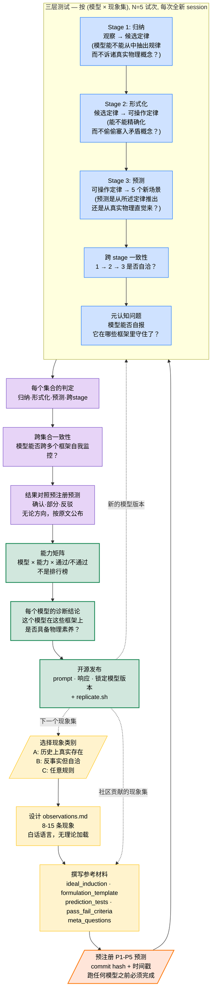

# PhysLit — 产品说明（中文版）

> 一个开源的"大模型物理素养"诊断工具——用归纳、形式化、预测三个认知维度上的二元判定，替代传统物理 benchmark 的百分制分数。

> **English version:** [product-spec.md](./product-spec.md)
> **翻译说明：** 本文档是 [product-spec.md](./product-spec.md) 的中文版。所有内容应与英文版保持同义；如有冲突，以英文版为准。

---

## 目录

1. [项目概述](#1-项目概述)
2. [背景与动机](#2-背景与动机)
3. [核心假设与预注册预测](#3-核心假设与预注册预测)
4. [方法论](#4-方法论)
5. [现象集设计](#5-现象集设计)
6. [评测协议](#6-评测协议)
7. [与现有工作的差异](#7-与现有工作的差异)
8. [研究里程碑](#8-研究里程碑)
9. [成功标准](#9-成功标准)
10. [仓库结构](#10-仓库结构)
11. [风险分析](#11-风险分析)
11A. [局限性](#11a-局限性)
12. [执行节奏](#12-执行节奏)

---

## 1. 项目概述

### 1.1 一句话描述

**PhysLit 测的不是大模型能不能解物理题，而是它能不能"做物理"——在一个陌生的框架里，从观察出发归纳出定律，再用定律预测新情形。** 我们用三种认知能力（归纳、形式化、预测）上的二元判定，取代百分制分数，并在 15 个框架世界里跑测试：有的来自历史上真实存在的物理理论，有的是反事实但自洽的虚构世界，有的是任意规则的人造世界。

### 1.2 核心想法

现有针对大模型的物理 benchmark，本质上是一场"解题比赛"：给模型一组物理题，统计正确率，给个百分数。这有两个致命问题。**其一**，无法分辨模型是真的理解物理，还是在训练时见过类似的题。**其二**，一个百分数没法区分"按物理学家的方式推理"和"模式匹配出和物理相关的文本"。

PhysLit 走另一条路。我们不问"模型能不能解题"，而是问"模型有没有构成物理素养的认知能力"——也就是归纳、形式化、预测。我们的测法是：让模型只看一组观察现象，从零构建物理理论，而这些"世界"可能是真实物理，也可能不是。

输出不是分数，是诊断结论。

### 1.3 项目状态

**v0.0.3 — 范围缩减 + 亚里士多德内容已起草**，2026-05-07。

原 v0.1 / v0.5 / v1.0 三级阶梯（1 → 5–7 → 15–20 框架；arXiv；5 次学术
引用）已**退役**。项目重定边界为：

- **v0.1**：单一框架（亚里士多德力学）× 3 模型，**≤ $50 USD**。
- **v0.2**：跨 A/B/C 三类的最多 5 个框架，**≤ $250 USD** ——*可选，并以
  v0.1 结果为前提*。
- v0.2 之后：无承诺。

这是一个"晚上写代码"的研究 artifact，不是有资助的 benchmark 项目。
新里程碑见 §8。

---

## 2. 背景与动机

### 2.1 缺口

物理 AI 和"世界模型"是当下 AI 研究的核心议题。Yann LeCun、李飞飞、黄仁勋都公开主张"必须要有 grounded 的世界模型才有真正的物理理解"。也有人坚持"光靠纯文本扩规模就能涌现出推理"。

但这场争论喧闹归喧闹，几乎没人造出过一个**严肃的测量工具**来回答最底层的那个问题：**特定的某个大模型，到底是在对物理进行推理，还是在检索和物理相关的文本模式？**

PhysLit 就是这个测量工具。

### 2.2 现有的大模型物理评测

现有评测大致分三类。

**第一类**是教材式 benchmark：物理奥赛题、MMLU 物理子集、大学物理考试题。这些已经被前沿模型基本攻破了。它们测的主要是对训练数据的模式匹配，不是物理推理。

**第二类**是反事实 physics benchmark，比如 NewtonBench：把经典物理定律做系统性修改，生成不易记忆的题目。比教材式好一些，但仍然把结果报成百分制，得出的结论模模糊糊："在条件 Y 下表现下降了 X 个百分点"。这种结论说不清模型的推理到底在哪一步崩了。

**第三类**是多模态物理推理 benchmark：测模型对视频或仿真的预测能力。需要物理直觉，但范围有限，并且不测物理推理的**生成性**那一面——即从观察构建定律。

### 2.3 缺什么

实际从业者、研究者、以及关心这件事的公众，真正想知道的问题，现有方法没有一个能回答：**这个模型像不像物理学家在思考？**

要回答这个问题，需要现有 benchmark 都缺的三件事。

**第一**，评测必须覆盖物理认知的完整循环——从观察 → 定律 → 预测。现有 benchmark 一次只测一个 stage，通常只测预测。

**第二**，评测必须用多个框架交叉印证。模型可能因为训练数据重叠在某一个框架里成功，在另一个框架里就崩。**只有跨多个框架都稳定通过，才暴露出真本事。**

**第三**，评测必须给二元判定，不是统计数字。"这个模型是不是物理学家"这个问题本身就是 yes/no。"这个模型能解出多少百分比的物理题"是另一个问题。

---

## 3. 核心假设与预注册预测

### 3.1 物理素养的定义

我们把**物理素养**（physics literacy）定义为以下三种能力的合取。

**归纳（Induction）**：能从一组观察现象中提取规律，并表达为一组无矛盾的候选规则。

**形式化（Formulation）**：能把归纳出的规则精炼为可操作的精确定律，能给出具体预测，能处理边界情况，能讲清适用范围。

**预测（Prediction）**：能把已经形式化的定律用到新情形上，给出**与所述定律一致**的预测——即使这个预测和直觉、和训练数据冲突。

模型当且仅当在多个独立的现象集上**稳定**展示出这三种能力，才算具备物理素养。

### 3.2 我们预期会发现什么

我们的假设是：当前的前沿大模型**不具备**上面定义的物理素养。这个假设在 §3.3 被操作化为一组具体可证伪的预测。如果前沿模型出乎预料地证明了具备物理素养，这个结果同样有意义——它会成为支持"扩规模就能产生推理"那一派的证据。

### 3.3 预注册预测

为了避免事后追述（post-hoc rationalization），我们在 v0.1 评测**开始之前**预注册下面这些可证伪的预测。预测的时间戳锚定在本文的 commit hash。v0.1 结果出来后，每条预测都会被判定为**确认**、**部分确认**或**反驳**，并按原文公布，不论结果方向。

**新计划（§8）下的范围：** v0.1 prereg lock **只锁 P1 和 P3**——它们在亚
里士多德单框架上即可测。**P2、P4、P5 需要跨多框架测试**，因此推迟到 v0.2
prereg lock（如果 v0.2 启动）。五条预测整体仍是项目的长期研究框架。

**P1 — 训练数据冲突下的归纳失败**：至少有一个前沿模型，在 Category A（如亚里士多德力学）上的 5 次试运行中，至少 3 次会引入"惯性"、"F=ma"、"动量守恒"等真实物理概念——而这些概念在给定观察里**根本推不出来**。

**P2 — Stage 间能力解耦**：至少有一个前沿模型，在同一个集合上，5 次试运行中至少 2 次"形式化通过、预测失败"。这说明"归纳出规则"和"一致地应用规则"是两种**可以分离**的能力。

**P3 — 元认知失校准**：当反向追问模型"你在哪些框架里维持了一致"时，模型至少在 30% 的情形下会**误判自己**——声称一致，而它的 stage 3 输出和 stage 1 规则相互矛盾。

**P4 — Category C 的崩溃模式不同**：Category C（任意规则世界）的归纳失败率会高于 Category A 和 B，但失败模式是**拒绝该框架**（"这不符合物理常识"），而不是 Category A 那种**滑回真实物理**。

**P5 — 跨集合不一致**：至少有一个前沿模型，在三个或更多集合上单独看都通过，但跨集合一致性检查失败——说明"局部成功"不等于有"统一的内部世界模型"。

完整预测原文和分析判据存于 `predictions/v0_1_prereg.md`。任一预测被反驳，都和确认享受同等显著度地公布。

---

## 4. 方法论

### 4.0 研究工作流

整个项目就是一个工作流，对（现象集 × 模型）做循环。下图给出**逻辑顺序**，不是日历时间顺序。每次循环产出一次开源发布。v0.1 / v0.5 / v1.0 的预计时间见 §8。



**配色解读**：

- **黄色** = 现象构建（搭这个框架世界）
- **橙色** = 预注册关卡（任何模型动数据之前必须完成）
- **蓝色** = 三层判定，是核心研究工具
- **紫色** = 汇总并对照预注册
- **绿色** = 开源发布产物

**三个回路驱动下一次迭代**：新增一个现象集、评测一个新模型版本、接受社区贡献的现象集。每个回路都以一次开源发布收尾——这是项目能"累积"的原因。

---

### 4.1 三层测试

每个现象集都过三个顺序 stage，外加跨 stage 和元认知检查。下图列出每一 stage 测什么、什么算通过、典型的失败长什么样；之后是文字详解。


**Stage 1：归纳测试**

给模型一组观察现象，要求它提出一组自洽的定律来解释这些现象。明确告诉模型不要使用现代物理概念，所有结论必须从给定观察推出。判据：所提的定律是否覆盖了所有观察？是否引入了观察未支持的概念？模型有没有抵抗住"上来就套真实物理"的反射？

**Stage 2：形式化测试**

要求模型把归纳定律表达为精确的可操作形式：尽可能给出数学关系、说明各定律的适用范围、点出哪些量守恒、写清边界条件。判据：定律是否精确到能产生具体预测？是否保持内部一致？有没有偷偷塞入与归纳前提矛盾的概念？

**Stage 3：预测测试**

给模型一组**原观察里不存在**的新场景，要求它**只用自己形式化的定律**来预测结果。判据：预测是否真的从所述定律推得？跨多个场景是否一致？有没有被真实物理直觉污染？

### 4.2 跨 stage 一致性

除了独立评估每一 stage，协议明确测跨 stage 的一致性。模型可能在每个 stage 单独看都通过，但 stage 之间相互矛盾。**举个例**：模型在 stage 1 归纳出"运动需要持续的力"；stage 2 把它形式化为"v ∝ F"；到 stage 3 又说"撤去力之后物体凭惯性继续运动"——这是一致性失败，即便每段单看局部都"看上去合理"。

跨 stage 一致性是物理素养最深层的信号。**没有一致性的模型，不是在用一个连贯的世界模型推理**——它只是在生成局部看上去合理的文本，而不维持对该框架的统一内部表征。

### 4.3 跨集合一致性

跑完多个现象集的全部三个 stage 之后，向模型问元认知问题。例如："在你刚刚推理过的 15 个框架里，哪些里面你保持了一致，哪些里面你又滑回了标准物理？"——真有元认知能力的模型应该能识别自己的失败。**只是模式匹配的模型识别不了。**

### 4.4 二元判定标准

每一个测试都产出二元结果：通过或不通过。每个现象集都**事先**写明判据，去除主观打分。能自动化的判据都自动化，需要语义解释的部分用 LLM 辅助判定。详见每个集合的 `pass_fail_criteria.md`。

### 4.5 操作细节

**每 stage 的试次数**：每一个 (模型, 现象集, stage) 组合跑 **N=5 次独立试运行**。试次之间清空对话上下文。Stage 级别"通过"要求 5 次中至少 **4 次**结果一致；试次间不一致单独报出来作为不稳定性信号。

**采样设置**：头条结果用 **temperature=0**（贪心解码，API 支持的话）。次要再跑一遍 **temperature=0.7**，单独报出来，用于检验随机性是否改变诊断结论。两套结果都进最终报告。

**上下文隔离**：Stage 1、2、3 在**全新 API 会话**里独立跑，不是单一 multi-turn 对话。这防止 stage 2 的推理泄漏到 stage 3 的预测。每个 stage 开始时模型只看到当 stage 指定的文档。

**Inter-rater 可靠性（IRR）**：当二元判定需要语义解释（例如"模型有没有引入观察里没有的概念"），用**两个独立的 LLM judge**（Claude 和 GPT）各自打分。分歧升级到人工 review。各现象集的分歧率作为方法论质量指标公布。

**Prompt 版本化**：所有 prompt 都打 version tag。每次试次实际使用的 prompt 和响应一起 commit，附 hash 串起 响应 → prompt 版本 → 模型版本。

---

## 5. 现象集设计

### 5.1 三类现象集

为了刻画大模型物理推理的认知地图，把现象集按"训练数据重叠度"分成三类。

**Category A：历史上真实存在的物理学**

这些是人类历史上真心相信过的物理理论，**内部自洽**，在训练数据里主要以"错的理论"身份出现。例子：亚里士多德力学、燃素说（燃烧）、热质说（热）、发光以太、地心说宇宙。挑战在于：模型要把它**当作真的**进入这个框架，尽管训练数据偏向于"否定"它。

**Category B：反事实但自洽的物理学**

虚构但内部一致的物理框架，**训练数据里几乎没有**。例子：反引力世界（引力朝上）、F=mv 世界（力正比于速度而非加速度）、慢光世界（c=10 m/s）、二维引力世界（1/r 而非 1/r²）、能量衰减世界（封闭系统每秒损失 1% 能量）。挑战是**纯归纳和预测推理**——没有任何训练先验可借。

**Category C：任意规则世界**

完全虚构的世界，规则不对应任何有意义的物理理论。例子：颜色力（红色物体下落、蓝色上升、绿色横移）、接触质量交换、观察者依赖物理。挑战是从**任意前提**推理，最大程度防止模式匹配。

### 5.2 现象集的长期路线图

下面这份清单是**长期参考路线**，不是 v0.1 承诺。按 §8 的修订里程碑：
**v0.1 仅覆盖第 1 项（亚里士多德力学）；v0.2 跨 A/B/C 三类最多覆盖 5 项；
v0.2 之后无承诺。**

**Category A：历史上真实**

1. **亚里士多德力学**：运动需要持续的力、自然位置说、重物落得快
2. **燃素说**：燃烧时释放燃素，金属灰 = 金属减燃素
3. **地心说宇宙**：地球静止，天球绕转，月球之上是完美圆周运动
4. **发光以太**：光是以太介质中的波，存在以太风
5. **冲力说（pre-Newtonian impetus）**：投掷物携带可耗尽的"冲力"

**Category B：反事实自洽**

6. **反引力世界**：重力朝上，其它规则不变
7. **F=mv 世界**：力正比于速度而非加速度
8. **慢光世界**：光速 10 m/s
9. **二维引力世界**：力按 1/r 衰减，导致开放轨道
10. **能量衰减世界**：封闭系统每秒损失 1% 能量

**Category C：任意规则**

11. **颜色力世界**：红色下落、蓝色上升、绿色横移
12. **接触质量交换世界**：接触物体按定速交换质量
13. **不对称守恒世界**：角动量守恒但线动量不守恒
14. **拉马克式物理世界**：练习过的运动模式跨代继承
15. **观察者依赖世界**：被观察 vs 未观察时物理定律不同

### 5.3 每个现象集的结构

每个现象集是一个独立目录，含以下文件。

`observations.md`：8–15 条观察现象，白话语言，不带理论包袱。

`ideal_induction.md`：理想归纳的参考描述，含适配观察的候选定律以及"可以出现 / 不该出现"的概念清单。

`formulation_template.md`：让模型把归纳定律形式化的结构化 prompt。

`prediction_tests.md`：5 个新场景，按框架自身的逻辑给出预期预测。每个场景同时写明**该框架预测什么**、**真实物理预测什么**——这样能识别模型何时滑回真实物理。

`pass_fail_criteria.md`：归纳、形式化、预测三 stage 的明确二元判据。

`meta_questions.md`：用于探查"模型是否意识到自己在哪个框架里推理"的问题。

---

## 6. 评测协议

### 6.1 受测模型

v0.1 评测三个前沿模型：**Claude Opus 4.7、GPT-5、Gemini 3**。在修订后的
$50 预算上限下，v0.1 **只跑 temperature=0**；§4.5 描述的 temperature=0.7
secondary pass 推迟到 v0.2（或者预算扩展时再补，看哪个先到）。开源权重
模型（DeepSeek、Llama）和推理优化变体不在当前计划内。

### 6.2 协议步骤

对每一对 (模型, 现象集) 执行如下步骤。

**Step 1**：给出观察，请求归纳规则。记录 5 次试运行的全部回答。应用归纳判据。记录结果。

**Step 2**：请求模型形式化它的规则。记录 5 次。应用形式化判据。记录结果。

**Step 3**：依次给出每个预测场景。记录 5 次跨场景的回答。应用预测判据。记录结果。

**Step 4**：给出元认知问题，请模型反思自己框架一致性。记录回答。应用元认知判据。

所有响应**逐字保存**。所有判定附明确推理。

### 6.3 诊断报告格式

每个被测模型都产出一份诊断报告，结构如下。

```
模型: GPT-5 (gpt-5-20260201)
日期: 2026-XX-XX
设置: temperature=0, n_trials=5

各集合结果
==========

亚里士多德力学:
  归纳:           FAIL  (5 次中 4 次滑回真实物理)
  形式化:          PASS
  预测:           FAIL  (5 次中 3 次预测与所述定律不一致)
  跨 stage 一致性:  FAIL

[... 其余 14 个集合 ...]

跨集合一致性
============
[元认知评估结果]

预注册预测
==========
P1: 确认
P2: 部分确认
P3: 反驳
[等等]

总体诊断
========
该模型是否具备物理素养？
[具体诊断结论 + 推理]
```

报告里**没有百分制分数**。

### 6.4 公开能力矩阵

项目在 GitHub Pages 上维护一张公开**能力矩阵**——是表格，不是排名。每行是一个模型，每列是一项认知能力，每格是二元指示。这种格式直接传达能力边界，不暗示某些模型"全方位优于"另一些。

### 6.5 可复现承诺

PhysLit 从 v0.1 起承诺以下复现标准：

- **公开 prompt** — 发给模型的每一条 prompt 在仓库中**逐字公开**
- **公开响应** — 每一条模型响应**逐字保存**，附时间戳和模型版本锁
- **锁定模型版本** — 每条结果都打**完整版本字符串**（如 `claude-opus-4-7-20260101`、`gpt-5-20260201`），从不只用 family name
- **确定性设置** — temperature=0 是头条结果；非确定性结果显式标注
- **现象集版本化** — 现象集打 version tag（v1.0、v1.1……），保证未来对同一集合的重测可比
- **复现工具包** — `replicate.sh` 在有合法 API key 的前提下能重跑评测，结果与原结果一致或等价
- **预注册存档** — 预测附 commit hash 存档，任何读者都能验证"结果出来之前预测了什么"

未来某个评测者可以拿任何现象集的 v1.0，跑一个新模型，得出与我们的结果**直接可比**的结论。

---

## 7. 与现有工作的差异

### 7.1 与 NewtonBench 比较

NewtonBench（ICLR 2026）用反事实定律变换生成抗记忆的物理题。是和 PhysLit 最直接相关的工作。

PhysLit 在四点上不同。

**第一**，NewtonBench 报 324 个任务的表现分。PhysLit 报对认知能力的二元判定。

**第二**，NewtonBench 把"discovery 阶段"当成静态函数拟合。PhysLit 测**完整循环**——归纳 + 形式化 + 预测——并显式做跨 stage 一致性检查。

**第三**，NewtonBench 通过机械修改正典定律生成反事实。PhysLit 混合**历史上真实存在**的物理框架和**反事实虚构**世界，利用历史框架的内部自洽性以及它们在训练数据里的特殊位置。

**第四**，NewtonBench 不含元认知测试。PhysLit 显式探查**模型能否识别自己的框架一致性**。

### 7.2 与其他 benchmark 比较

CritPt、SIRBench、CounterLogic 等反事实推理 benchmark 与 PhysLit 有共通之处，但各自在范围或方法上分叉。**没有任何一个用二元判定 + 跨多个物理框架 + 完整认知循环**这三者并举。

详细对比见 `docs/comparison_with_existing_benchmarks.md`。

### 7.3 独特位置

PhysLit 占据一个现有 benchmark 都没填的位置：一个**诊断仪器**，给出对大模型认知能力的**类别判定**，**基于一个有原则的"物理素养"定义**。无论将来其他项目是否产出类似评测，本项目奠定了概念框架。

---

## 8. 研究里程碑

原 v0.1 / v0.5 / v1.0 三级阶梯（4 + 8 + 14 周；1 → 5–7 → 15–20 框架）
已退役（2026-05-07），改为更小、有预算上限的计划。这是一个"晚上写代码"
的研究 artifact，不是有资助的 benchmark 项目。

### 8.1 v0.1 — 亚里士多德探针

**目标**：在亚里士多德力学这一个现象集上做出端到端可用的诊断，含完整
预注册和复现包，**总成本控制在 $50 USD 以内**。

**范围**：

- 1 个框架：亚里士多德力学（Category A，Tier 3 manual）
- 受测 3 个模型：Claude Opus 4.7、GPT-5、Gemini 3
- 协议：N=5 次试运行 × **temperature=0** × 4 个 stage（归纳、形式化、
  预测、元认知）
- temperature=0.7 secondary pass **推迟**（预算所限）；预算松动后再补
- Stage 1–3 的响应过 dual-judge IRR（Claude + GPT）
- 预注册：**只锁 P1 + P3**；P2 / P4 / P5 需要跨多框架测试，留到 v0.2
  prereg lock

**交付物**：

- 方法论文档（即本文件）✅
- 亚里士多德现象集（DRAFT — prereg lock 之前需作者 + 外部物理训练有素
  读者 review）
- Phase 1.5 dry run smoke test（仅 Claude，N=1，探索性；输出在
  `results/_dryrun/`）
- v0.1 预注册预测在任何正式跑模型之前 commit
- Claude / OpenAI / Gemini API 自动 runner
- Dual-judge IRR pipeline
- 三个前沿模型在亚里士多德上的诊断报告
- 一篇配套博客 / 预印本提纲

**预算上限**：≤ $50 USD（受测模型 + judge 全包）。

### 8.2 v0.2 — 五框架扩展（可选，以 v0.1 结果为前提）

**目标**：把探针扩到最多 5 个跨 A/B/C 三类的框架。

**进入 v0.2 的门槛**：

- v0.1 出至少**一条有实质意义**的发现
- v0.1 在亚里士多德上的 dual-judge 分歧率 < 25%
- 预算尚有余量（v0.2 目标 ≤ $250 USD）

**暂定的 5 个框架（v0.2 prereg lock 之前可改）**：

- 01_aristotelian（A）—— 从 v0.1 延续
- 02_phlogiston / 燃素说（A）
- F=mv 世界（B，Tier 1 simulator）
- 反引力世界（B，Tier 1 simulator）
- 颜色力世界（C，Tier 1 simulator）

这套选择覆盖三类，混合 2 个 Tier 3（手写）+ 3 个 Tier 1（simulator
生成），同时锻炼 Phase 2 的 simulator base class。

**预注册**：P2、P4、P5 在 v0.2 prereg lock 时 commit。

**预算上限**：≤ $250 USD。

### 8.3 v0.2 之后

**无承诺**。仅在 v0.2 自身值得继续的情况下，可选路径：

- 给 v0.1 + v0.2 的框架补上 temperature=0.7 secondary pass（预算允许时）
- 接受社区贡献的框架（作者一方无 API 边际成本）
- 基于 v0.1 + v0.2 结果写博客 / arXiv 预印本

早期那些 15 框架覆盖、多次学术引用、社区贡献标准化模板的 ambition 已经
**无限期推迟**。本项目的贡献是**方法论框架本身**；框架数量是次要乘数。

---

## 9. 成功标准

每个里程碑的成功标准是**二元**的，不打分。不达标触发项目复审（修订
范围 / 接受缩减范围 / 归档项目），**不延期**。

### 9.1 v0.1 成功标准

- 仓库公开，含宽松许可证 ✅
- 方法论文档完整自洽（外部研究者仅凭仓库即可执行协议）
- 亚里士多德现象集在 prereg lock 之前由作者 + 外部物理训练有素读者
  review 过
- 预注册预测（P1 + P3）已 commit，时间戳确定，自首次 commit 以来未修改
- v0.1 结果通过提供的复现包能端到端复现
- **总成本 ≤ $50 USD**
- 至少收到一份对方法论的实质性外部反馈

### 9.2 v0.2 成功标准

- 5 个框架的现象集材料齐全
- v0.2 prereg（P2 + P4 + P5）在任何模型动数据之前 commit
- 三个模型在五个框架上的诊断报告齐
- **总成本 ≤ $250 USD**
- 一篇公开 write-up（博客或预印本提纲）

如果 v0.1 不达标，v0.2 不启动。

---

## 10. 仓库结构

```
physlit/
├── README.md
├── METHODOLOGY.md
├── PRODUCT_PLAN.md          ← 本文件
├── LICENSE                  ← MIT
├── predictions/
│   └── v0_1_prereg.md       ← 时间戳预注册
├── phenomena_sets/
│   ├── 01_aristotelian/
│   │   ├── observations.md
│   │   ├── ideal_induction.md
│   │   ├── formulation_template.md
│   │   ├── prediction_tests.md
│   │   ├── pass_fail_criteria.md
│   │   └── meta_questions.md
│   ├── 02_phlogiston/
│   ├── ...
│   └── 15_observer_dependent/
├── runners/
│   ├── claude_runner.py
│   ├── openai_runner.py
│   ├── gemini_runner.py
│   └── shared/
├── results/
│   ├── claude_opus_47/
│   ├── gpt_5/
│   └── gemini_3/
├── analysis/
│   ├── v0_1_findings.md
│   ├── cross_set_consistency.md
│   └── capability_matrix.md
├── docs/
│   ├── why_not_just_score.md
│   ├── comparison_with_existing_benchmarks.md
│   ├── how_to_contribute_a_phenomenon_set.md
│   └── faq.md
├── replicate.sh             ← 复现包
└── leaderboard/
    └── data.json
```

---

## 11. 风险分析

### 11.1 风险：低估工作量

**概率**：高
**影响**：高
**缓解**：阶段 1 故意只做一个现象集 + 三个模型。如果四周内做不下来，证明计划本身错了——必须改计划，**不许延期**。

### 11.2 风险：方法论被批评

**概率**：中
**影响**：中
**缓解**：与先前工作的明确对比、判据透明记录、预注册预测、对实质性批评保持开放修订。**权威来自智识诚实，不来自永不出错。**

### 11.3 风险：被更大体量的工作抢先

**概率**：中
**影响**：低
**缓解**：阶段 1 尽快公开，确立时间戳。"把物理素养当作二元诊断对象"这个**概念框架本身**就是贡献；之后构建在此之上的工作会引用它。

### 11.4 风险：结果毫无悬念

**概率**：低
**影响**：低
**缓解**："前沿大模型出乎预料地展示出物理素养"这个发现本身就重要。预注册保证结果**无论方向都值得报道**。

### 11.5 风险：方法论在发表压力下漂移

**概率**：中
**影响**：高
**缓解**：所有判据、prompt、预测都在 v0.1 阶段预注册（见 §3.3），任何模型动数据之前 commit + hash。后续修订**必须打版本 tag + 写明理由**，永不静默修改。任何与预注册方法论的偏离都在公布结果时显式标注。

---

## 11A. 局限性

PhysLit 是针对**一种特定**物理推理的诊断仪。它不测：

- **基于感知的物理推理** — PhysLit 全在文本里跑。它不能测模型在视觉 / 仿真环境里的物理推理。多模态物理推理是另一种独立能力。
- **数学问题求解** — 现有 benchmark 已经测过这些；PhysLit **故意**作为补充，不替代。
- **领域知识广度** — 模型可以在 PhysLit 的 15 个框架上通过，仍然在化学、生物或其他领域上不及格。
- **真实世界预测能力** — PhysLit 测的是**指定框架内**的内部一致性推理。它不测模型能否预测**不符合任何干净框架**的真实物理世界。

PhysLit 的**正面判定**（"该模型在这些框架上展现物理素养"）比**负面判定**（"该模型在这些框架上失败；它在别的框架上可能仍然通过"）更强。读者据此理解结果。

方法论上，PhysLit 同时承认：

- **现象集选择偏差** — 15 个集合反映作者的选择。换一组可能给出不同结果。**缓解**：选择标准公开、社区贡献渠道开放。
- **prompt 工程敏感性** — 模型对 prompt 敏感是众所周知的事。PhysLit 报固定 prompt 模板下的结果；换一套 prompt 结果可能不同。固定 prompt 公开。
- **v0.1 单作者判定** — pass/fail 判据已操作化，但仍不可避免反映作者解读。v0.5+ 引入外部 review。
- **前沿模型滞后** — 模型版本会演化。结果绑定具体版本字符串；**读者不得**从"Claude Opus 4.7 在 X 上失败"推论"现版 Claude 在 X 上失败"。

---

## 12. 执行节奏

项目**没有固定周计划**。工作按自包含的 phase 推进（详见
[`implementation-guide.md`](./implementation-guide.md)），每个 phase
作为一次 feature commit 落到 `main` 上；每完成一个 phase 立刻 push 到
远端，让仓库的远端记录每一步。原本的四周冲刺计划已退役，改成
phase-bounded 的工作节奏；时序见 [`CHANGELOG.md`](../CHANGELOG.md)。

---

## 附录 A：命名

项目名 **PhysLit**（2026-05-04 决定）。完整描述性标题 "Physics Literacy Probe"（物理素养探针）用于 arXiv 摘要和学术引用。曾考虑过的候选：AristotleBench、Physics Literacy Probe（现作副标题）、LitmusPhys。

## 附录 B：许可证

项目以 MIT License 发布。现象集以 CC BY 4.0 发布。允许学术和商业使用，需署名。

## 附录 C：引用

arXiv 预印本上线后会加入 `CITATION.cff` 文件以便规范学术引用。

---

*最后更新：2026-05-06*
*文档负责人：[作者]*
*状态：pre-development*
